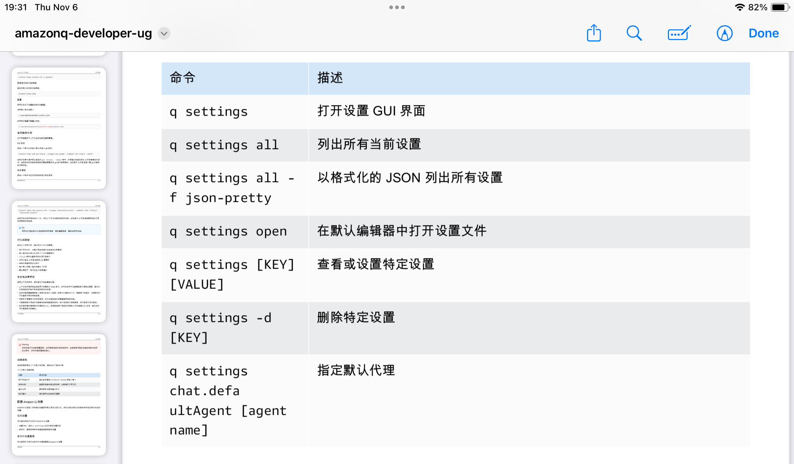
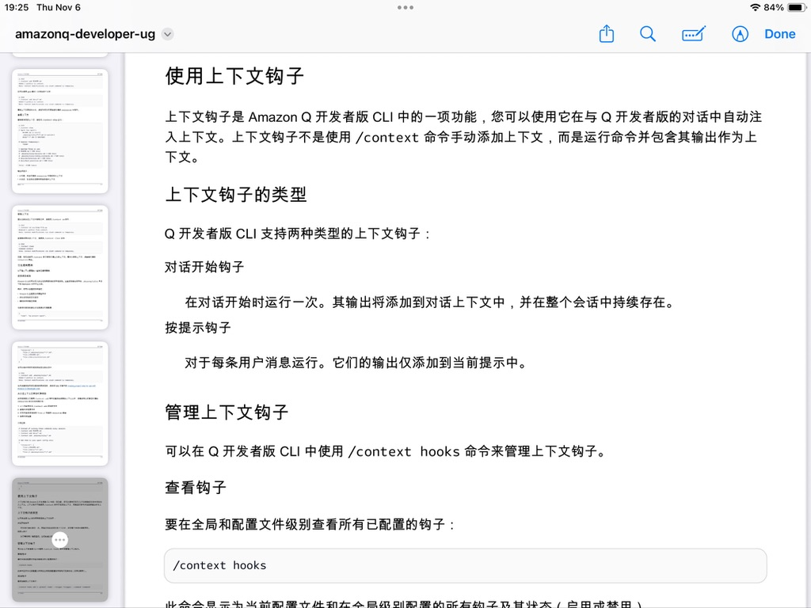

# Amazon Q document PDF

## /tools 管理工具权限

```sh
Amazon Q> /tools trust fs_read
Amazon Q> /tools untrust execute_bash
```

## 为聊天会话设置默认模型

可以使用以下命令更改 Amazon Q 在您开始聊天会话时使用的默认模型：

```sh
q settings chat.defaultModel claude-sonnet-4.5
```

## 使用图像

Amazon Q 可以在聊天会话中直接分析和讨论图像。可以通过将图像拖放到终端窗口或使用带图像模式的 fs_read 工具来与 Amazon Q 共享图像。

- 与 Amazon Q 共享图像的最简单方法是将它们直接拖放到终端窗口中。
- 也可以显式使用 fs_read 工具来共享图像 `Amazon Q> Can you analyze this screenshot at /path/to/screenshot.png?`

# 自定义代理

与自定义代理开始新的聊天会话：

```sh
q chat --agent my-agent
```

## 自定义代理文件位置

自定义代理配置文件以 JSON 文件形式存储在特定目录中：

**全局自定义代理**

```
~/.aws/amazonq/cli-agents/{agent-name}.json
```

在系统上的所有项目和目录中可用。

**项目级自定义代理**

```
.amazonq/cli-agents/{agent-name}.json
```

仅在特定的项目目录及其子目录中可用。

## 要获得任何命令的帮助，

请使用--help标志：

```sh
q [COMMAND] --help
```

## Q Setting



## 使用上下文钩子



## 恢复上次的对话

```sh
q chat --resume 
```

## Setting a default agent

You can configure a custom agent as your default for all chat sessions:

```sh
q settings chat.defaultAgent my-preferred-agent
```

# To delete the setting:

```sh
q setting chat.defaultAgent --delete
```