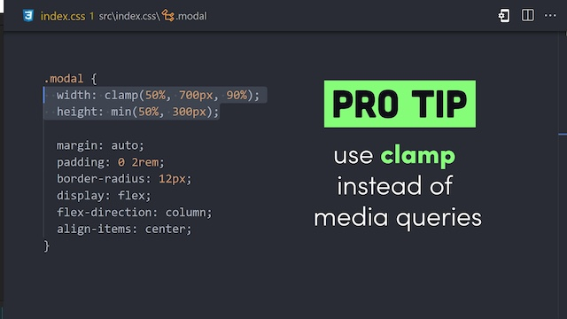
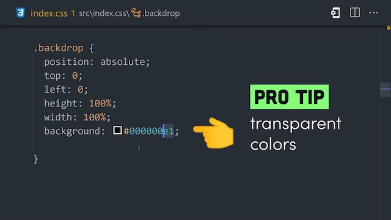

# `before` and `after` in EmotionJS

The `content` property of `before` and `after` pseudo element must be wrapped by double quote `""` or single quote `''`. 

```js
const X = styled.div`
  &::before {
    content: ${() => (true ? '"oo"' : `"ff"`)};

    // DOES NOT WORK
    content: ${() => (true ? '`oo`' : "`ff`")};
  }
`;
```

# Popover in CSS only

https://x.com/i/status/1823009673777127426


# CSS pro tips

https://www.youtube.com/watch?v=SuqU904ZHA4

#### `clamp()` in CSS

https://developer.mozilla.org/en-US/docs/Web/CSS/clamp



#### RGBA shortcut



# Media Query range support

https://caniuse.com/css-media-range-syntax

https://www.youtube.com/shorts/mrzA2B5gUmI

```css
/* Before */

/* if the width === 600px, both background and font-size applies */
/* so need to set it as 599px */
@media (max-width: 600px) {
  article { background: red; }
}
@media (min-width: 600px) {
  article { font-size: 2rem; }
}

/* After */
@media (max-width < 600px) {
  article { background: red; }
}
@media (min-width >= 600px) {
  article { font-size: 2rem; }
}
```

# `min-width: fit-content`

https://youtu.be/3ugXM3ZDUuE?t=162

https://developer.mozilla.org/en-US/docs/Web/CSS/fit-content


# Define CSS style type in React

```js
interface MyComponentProps {
  styles: React.CSSProperties; // 🚀
}

const MyComponent: React.FC<MyComponentProps> = ({ styles }) => {
  return <div style={styles}>Hello, world!</div>;
};
```

# `accent-color` in CSS

https://developer.mozilla.org/en-US/docs/Web/CSS/accent-color

Setting `accent-color` for HTML controls, support the following elements:

- \<input type="checkbox"\>
- \<input type="radio"\>
- \<input type="range"\>
- \<progress\>

# Animate On Scroll With Just 3 LINES Of CSS

https://www.youtube.com/watch?v=0TnO1GzKWPc

```css
@keyframes appear {
  from {
    opacity: 0;
    clip-path: inset(100% 100% 0 0);
  }
  to {
    opacity: 1;
    clip-path: inset(0 0 0 0);
  }
}

.block {
  animation: appear linear;
  animation-timeline: view();
  animation-range: entry 0% cover 40%;
}
```
