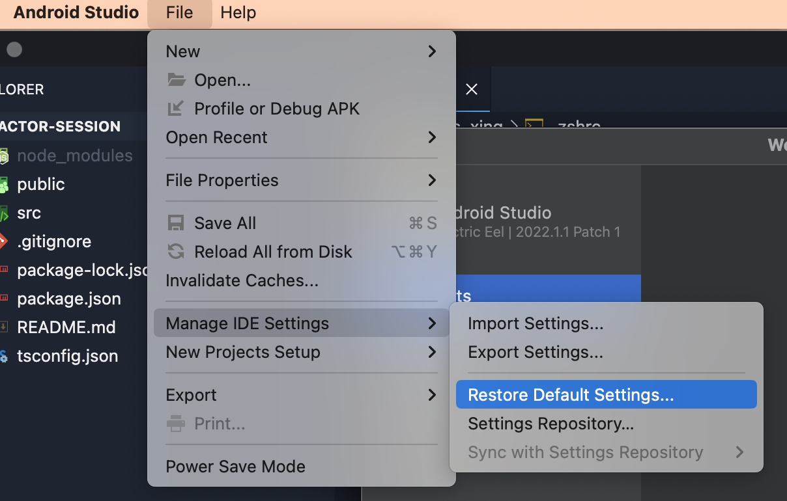

# Environment Setup

## Useful commands

`echo $SHELL` : Echo the pwd of current Bash

<kbd>cmd + shift + .</kbd> : show hidden files on Mac

### RESET Android Studio configuration



Receives the following info at the end of setup wizard:

> SDK Folder: /Users/chris_xing/Library/Android/sdk
> 
> JDK Location: /Applications/Android Studio.app/Contents/jbr/Contents/Home

### Youtube

https://www.youtube.com/watch?v=h8SvicbC1YE

https://www.youtube.com/watch?v=GkhCirFXh_I

### Setup Java Env.

- Execute `/usr/libexec/java_home` in bash, then echo 
  > `/Users/chris_xing/Library/Java/JavaVirtualMachines/openjdk-19.0.2/Contents/Home`
- `echo $SHELL` to echo current shell used, and create or edit RC file(`.zshrc`): 
   > export JAVA_HOME="/Users/chris_xing/Library/Java/JavaVirtualMachines/openjdk-19.0.2/Contents/Home"
- Create soft link: https://stackoverflow.com/a/68575967
  > cd /Applications/Android\ Studio.app/Contents
  >
  > ln -s jbr jre


# Useful interface

```dart
class TapboxB extends StatelessWidget {
  TapboxB({Key 👈 key, this.active: false, @required this.onChanged})
      : super(key: key);

  final bool active;
  final ValueChanged<bool> 👈 onChanged;
```

To use @required, import the foundation library (which re-exports Dart’s meta.dart library):

```dart
import 'package:flutter/foundation.dart';
```

还可以这么写：

```dart
@override
  Widget build(BuildContext context) {
    return Scaffold(
      appBar: AppBar(),
      body: ListView(
        children: [ 👇
          for (var book in books)
            ListTile(
              title: Text(book.title),
              subtitle: Text(book.author),
              onTap: () => onTapped(book),
            )
        ],
      ),
    );
  }
```

# Invoking a non-default superclass constructor

By default, a constructor in a subclass calls the superclass’s unnamed, no-argument constructor. The superclass’s constructor is called at the beginning of the constructor body. If an initializer list is also being used, it executes before the superclass is called. In summary, the order of execution is as follows:

- initializer list
- superclass’s no-arg constructor
- main class’s no-arg constructor

If the superclass doesn’t have an unnamed, no-argument constructor, then you must manually call one of the constructors in the superclass. Specify the superclass constructor after a colon (:), just before the constructor body (if any).

```dart
class Person {
  String? firstName;

  Person.fromJson(Map data) {
    print('in Person');
  }
}

class Employee extends Person {
  // Person does not have a default constructor;
  // you must call super.fromJson(data).
  Employee.fromJson(Map data) : super.fromJson(data) {
    print('in Employee');
  }
}

void main() {
  var employee = Employee.fromJson({});
  print(employee);
  // Prints:
  // in Person
  // in Employee
  // Instance of 'Employee'
}
```

# https://flutter.dev/docs/development/ui/widgets-intro

You might wonder why StatefulWidget and State are separate objects. In Flutter, these two types of objects have different life cycles. Widgets are temporary objects, used to construct a presentation of the application in its current state. State objects, on the other hand, are persistent between calls to build(), allowing them to remember information.

