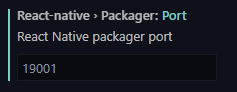

# MacOS

In LaunchPad, holding <kbd>Option</kbd> key can uninstall apps instantly.

# React Native 0.64

## Inline Requires enabled by default for better performance.

Before:

```ts
import { MyFunction } from 'my-module';

const MyComponent = (props) => {
  const result = MyFunction();

  return (<Text>{result}</Text>);
};
```

After:

```ts
const MyComponent = (props) => {
  const result = require('my-module').MyFunction();

  return (<Text>{result}</Text>);
};
```

## React 17

The main change is a new JSX transform enabling files to no longer need to import `React` to be able to use JSX.

# React Types

https://reactnative.dev/docs/flatlist#listemptycomponent

- React Component (e.g. SomeComponent)
- React element (e.g. <SomeComponent />)

# `addEventListener` support abort

https://developer.mozilla.org/en-US/docs/Web/API/EventTarget/addEventListener#parameters

https://jakearchibald.com/2021/function-callback-risks/

```ts
const controller = new AbortController();
const { signal } = controller;

el.addEventListener('mousemove', callback, { signal });
el.addEventListener('pointermove', callback, { signal });
el.addEventListener('touchmove', callback, { signal });

// Later, remove all three listeners:
controller.abort();
```

# Installing react-native-unimodules

https://docs.expo.io/bare/installing-unimodules/

This library contains infrastructure and a small set of foundational libraries and interfaces that are commonly depended on by other modules. You can install react-native-unimodules in any react-native app, and once it is installed you can use most of the libraries from the Expo SDK, like expo-camera, expo-media-library and many more.

> If you are creating a new project, we recommend using `npx create-react-native-app` (https://github.com/expo/create-react-native-app) instead of `npx react-native init` because it will handle the following configuration for you automatically.

# Using Libraries in React Native

https://reactnative.dev/docs/libraries

**React Native Directory** https://reactnative.directory/

## Linking Native Code on iOS

React Native uses CocoaPods to manage iOS project dependencies and most React Native libraries follow this same convention.

Run `pod install` in our ios directory in order to link it to our native iOS project. A shortcut for doing this without switching to the ios directory is to run:

```ts
npx pod-install
```

Once this is complete, re-build the app binary to start using your new library:
```ts
npx react-native run-ios
```

## Linking Native Code on Android

React Native uses Gradle to manage Android project dependencies. After you install a library with native dependencies, you will need to re-build the app binary to use your new library:

```ts
npx react-native run-android
```

# `$$` in DevTools

In DevTools, `$$` is shorthand for

```ts
Array.from(document.querySelectorAll())
```

Leran more https://developers.google.com/web/tools/chrome-devtools/console/utilities

# Building React Components Using Children Props and Context API

https://blog.soshace.com/en/javascript/building-react-components-using-children-props-and-context-api/

What we need first is React.Children.toArray(children) to always handle children as an array because when there is only one component, it will not be an array by default.

# Re-export a component as default

https://reactjs.org/docs/code-splitting.html#named-exports

```ts
// ManyComponents.js
export const MyComponent = /* ... */;
export const MyUnusedComponent = /* ... */;

// MyComponent.js
export { MyComponent as default 👈 } from "./ManyComponents.js";
```

# Generic type support default type

https://www.smashingmagazine.com/2021/01/dynamic-static-typing-typescript/


```ts
type ServerRequest<Met extends Methods, Par extends string = string> = {
  method: Met;
  params: Record<Par, string>;
};
```

# `Intl` API

As a bonus and because `Intl` is part of `ECMAScript`, it is also available in Node.js. You will want to be more careful with defaults when working on server though. The time zone, for example, is going to be where the server is located, not the time zone of your user. I recommend working in `UTC` on servers and using users’ time zones when displaying the datetime.

# Static property for both class component & function component

```ts
class C extents Component {
  static sharedElement = (route, otherRoute, showing) => {}
}

const C = () => (<></>)
C.sharedElement = (route, otherRoute, showing) => {}
```

# Use derived types

```ts
const theme = {
  color: {},
  spacing: {},
};

export type Theme = typeof theme;
```

# Search and replace in VSCode

https://code.visualstudio.com/docs/editor/codebasics#_advanced-search-options

In the two input boxes below the search box, you can enter patterns to include or exclude from the search. If you enter example, that will match every folder and file named example in the workspace. If you enter ./example, that will match the folder example/ at the top level of your workspace. Use , to separate multiple patterns. Paths must use forward slashes. You can also use glob syntax:

- `*` to match one or more characters in a path segment
- `?` to match on one character in a path segment
- `**` to match any number of path segments, including none
- `{}` to group conditions (for example {\*\*/\*.html,\*\*/\*.txt} matches all HTML and text files)
- `[]` to declare a range of characters to match (example.[0-9] to match on example.0, example.1, …)


# Tips from React Native document

## Resize mode for `<Image>`

https://reactnative.dev/docs/image#resizemode

Determines how to resize the image when the frame doesn't match the raw image dimensions. Defaults to cover.

- `cover`: Scale the image uniformly (maintain the image's aspect ratio) so that both dimensions (width and height) of the image will be equal to or larger than the corresponding dimension of the view (minus padding).

- `contain`: Scale the image uniformly (maintain the image's aspect ratio) so that both dimensions (width and height) of the image will be equal to or less than the corresponding dimension of the view (minus padding).

- `stretch`: Scale width and height independently, This may change the aspect ratio of the src.

- `repeat`: Repeat the image to cover the frame of the view. The image will keep its size and aspect ratio, unless it is larger than the view, in which case it will be scaled down uniformly so that it is contained in the view.

- `center`: Center the image in the view along both dimensions. If the image is larger than the view, scale it down uniformly so that it is contained in the view.

## Default values of `FlexBox` in React Native

https://reactnative.dev/docs/flexbox#flex-wrap

1. `flexDirection` defaulting to `column` instead of `row`;
2. `alignContent` defaulting to `flex-start` instead of `stretch`;
3. `flexShrink` defaulting to `0` instead of `1`;
4. `flex` parameter only supporting a single number.

## `style` vs `contentContainerStyle` in `ScrollView`

https://stackoverflow.com/questions/52892304/style-vs-contentcontainerstyle-in-scrollview

`ScrollView` is a special kind of View, which has two parts:

1. Container (the grey box), it's the outside View, its height can't exceed 100% of the window height.
2. Content (marked in blue) is the inner part, it can be higher than the window height, it's what's moving inside the container.


ScrollView `style` defines the outer container of the `ScrollView`, e.g its `height` and `relations` to siblings elements

ScrollView `contentContainerStyle` defines the inner container of it, e.g items `alignItems`, `padding`, etc

## On `<ScrollView />`

https://reactnative.dev/docs/scrollview

Keep in mind that ScrollViews **must have a bounded height** in order to work, since they contain unbounded-height children into a bounded container (via a scroll interaction). In order to bound the height of a ScrollView, either set the height of the view directly (discouraged) or make sure all parent views have bounded height. Forgetting to transfer {flex: 1} down the view stack can lead to errors here, which the element inspector makes quick to debug.

`<ScrollView>` vs `<FlatList>` - which one to use?

`ScrollView` renders all its react child components at once, but this has a performance downside.

`FlatList` renders items lazily, when they are about to appear, and removes items that scroll way off screen to save memory and processing time.

`FlatList` is also handy if you want to render separators between your items, multiple columns, infinite scroll loading, or any number of other features it supports out of the box.

## Use `contentContainerStyle` in customer component

https://reactnative.dev/docs/scrollview#contentcontainerstyle

While designing customer component, we can use `contentContainerStyle` to define the component's container style.

```ts
export const C = ({ contentContainerStyle, style }) => (
  <View style={[styles.container, ...contentContainerStyle 👈]}>
    <Text style={[styles.content, ...styles 👈]}>Hello</Text>
  </View>
)

## Set `<Text />` as block

https://reactnative.dev/docs/text

```ts
const TextInANest = () => {
  const titleText = useState("Bird's Nest"); // 👈 useful if need value only,
  const bodyText = useState("This is not really a bird nest.");

  return (
    // <Text /> can be set as block             👇
    <Text style={[styles.titleText, {display: 'flex'}]}>
      {titleText}
    </Text>
  );
};
```

## Styling on `<View />`

https://reactnative.dev/docs/view

Views are designed to be used with StyleSheet for clarity and performance, although inline styles are also supported.

# `useRef` and `setTimeout` in TypeScript

```ts
                          👇                          👇
const timer = useRef<ReturnType<typeof setTimeout>>(null!);

useEffect(() => {
  timer.current = setTimeout(function updater() {
    setCurrent((current + 1) % length);

    timer.current = setTimeout(updater, duration);
  }, duration);
  return () => {
    clearTimeout(timer.current);
  };
}, [current, duration, length]);
```

# Record screen in iOS Simulator

https://stackoverflow.com/questions/25797990/capture-ios-simulator-video-for-app-preview

# `onBlur` and `onFocus` issues of `TextInput`

In Android, the following code will print `undefined`.

```ts
const onFocus = ({ nativeEvent: { text } }) => console.log(text);
const onBlur = ({ nativeEvent: { text } }) => console.log(text);
```

How to fix

1️⃣ access the value from some kind of store.
```ts
const [value, setValue] = useState('');

const onChangeText = (text) => setValue(text);
const onFocus = () => console.log(value);
const onEndEditing = () => console.log(value);
```

2️⃣ use `onEndEditing` instead of `onBlur`

# Query keys from React Query

https://react-query.tanstack.com/guides/query-keys#if-your-query-function-depends-on-a-variable-include-it-in-your-query-key


React Query use query keys to unique the cache for data.

All the variables which effect the query should be listed in the query keys.

**Of array form**

1️⃣ Both of the following query forms work, but the order matters in array form.

2️⃣ The first string type item is ❓ optional, the variables are enough to make the cache invalidate.


```ts
export const useTransferWiseQuote = (initialParams) => {
  const { data: TransferWiseUser } = useQuery(queryKeys.twUser, getTwId);

  const { twCustomerId } = TransferWiseUser;

  const customerId = `tw_customer_id=${twCustomerId}`;

  const [
    {
      sourceAmount, sourceCurrency, targetAmount, targetCurrency,
    },
    setParams,
  ] = useState(initialParams);

  const initialData = useMemo(
    () => ({
      fee: 0,
      formattedEstimatedDelivery: '',
      id: '',
      rate: 0,
      rateType: '',
      targetAmount: 0,
      ...initialParams,
    }),
    [initialParams],
  );
  const amountKey = sourceAmount ? 'sourceAmount' : 'targetAmount';
  const amountValue = sourceAmount || targetAmount;
  const amountString = `${amountKey}=${amountValue}`;
  const sourceCurrencyString = `sourceCurrency=${sourceCurrency}`;
  const targetCurrencyString = `targetCurrency=${targetCurrency}`;
  const joined = [
    customerId,
    amountString,
    sourceCurrencyString,
    targetCurrencyString,
  ].join('&');

  const url = `${ApiEndpointTransferWise}/quotes/v1/getQuote?${joined}`;

  const { error, data } = useQuery(
    [
      queryKeys.twQuote, // 2️⃣  Optional 
      {
        sourceAmount, // 1️⃣ Order does NOT matters
        sourceCurrency,
        targetAmount,
        targetCurrency,
      },
    ],
    () => httpRequest.get(url),
    { initialData },
  );

  const { error, data } = useQuery(
    [
      queryKeys.twQuote, // 2️⃣ Optional 
      sourceAmount, // 1️⃣ Order matters
      sourceCurrency,
      targetAmount,
      targetCurrency,
    ],
    () => httpRequest.get(url),
    { initialData },
  );

  return [data, setParams];
};
```

# `React.memo` hint

https://www.youtube.com/watch?v=IuXpqUxJG90

By default it will only shallowly compare complex objects in the props object. So if a callback is passed as inline arrow function, it will cause a rerender.

Try to avoid use inline arrow function, or wrap it with `useCallback`

# Destructuring Object conditionally

```ts
const conditionallyProperty = {...(bool ? {foo: 'Foo'} : {})};
```

# Define `Enums` in JSDoc

https://stackoverflow.com/questions/19093935/how-to-document-a-string-type-in-jsdoc-with-limited-possible-values

```ts
/**
 * @typedef {"keyvalue" | "bar" | "timeseries" | "pie" | "table"} MetricFormat
 */

/**
 * @param format {MetricFormat}
 */
export function fetchMetric(format) {
    return fetch((`/`), format);
}
```

# Get key types from `Enum`

https://www.typescriptlang.org/docs/handbook/enums.html#enums-at-compile-time

```ts
enum LogLevel {
  ERROR,
  WARN,
  INFO,
  DEBUG,
}

/**
 * This is equivalent to:
 * type LogLevelStrings = 'ERROR' | 'WARN' | 'INFO' | 'DEBUG';
 */
type LogLevelStrings = keyof typeof LogLevel; // 👈  Got it.

function printImportant(key: LogLevelStrings, message: string) {
  const num = LogLevel[key];
  if (num <= LogLevel.WARN) {
    console.log("Log level key is:", key);
    console.log("Log level value is:", num);
    console.log("Log level message is:", message);
  }
}
printImportant("ERROR", "This is a message");
```

# Default parameter in ES6

https://es6.ruanyifeng.com/#docs/function#%E5%8F%82%E6%95%B0%E9%BB%98%E8%AE%A4%E5%80%BC%E7%9A%84%E4%BD%8D%E7%BD%AE

如果传入undefined，将触发该参数等于默认值，null则没有这个效果。

# Styled-Components features not support in React Native

- Note that the `flex` property works like CSS shorthand, and not the legacy `flex` property in React Native. Setting `flex: 1` sets `flexShrink` to `1` in addition to setting `flexGrow` to `1` and `flexBasis` to `0`.
- cannot use the `keyframes` and `createGlobalStyle` helpers since React Native doesn't support `keyframes` or `global` styles.
- You will be warned if you use media queries or nest your CSS.

# Styled Props tips in React Native

The following style props can be used as component props directly.

https://reactnative.dev/docs/view-style-props

Component will be styled with height and box shadow(Android only)

Although TypeScript complains that those two props are not available

```ts
<View 
  height={100} 👈
  elevation={10} 👈 
  style={{backgroundColor: 'white'}} />
```

> It DO NOT work on React Native for web

# Use React Native build-in style types

```ts
type ContainerProps = {
  // available options: ViewStyle | TextStyle | ImageStyle
  contentContainerStyle: ViewStyle; 👈
};

const Container = styled.FlatList<ContainerProps>`
  flex-grow: 0;
  margin: ${({contentContainerStyle: {margin}}) => margin ?? '10'}px;
`;
```

# Styled-components for React Native

### `attrs` method DO NOT support `style` props
```ts
type ViewStyledProps = {
  x?: number;
};

const ViewStyled = styled.View.attrs({x}) => ({
  // The following DO NOT work.
  style: {elevation: x, backgroundColor: 'red'},
}))``;
```

### How to define additional props

```ts
type ViewStyledProps = {
  elevation?: number;
};

const AnimatedViewStyled = styled(Animated.View)
  .attrs<ViewStyledProps 👈 >(props => ({}))<ViewStyledProps 👈 >`
    box-shadow: ${({elevation = 10}) => `0 0 ${elevation}px rgba(255, 0, 0, 0.5)`};
    background-color: white;
  `;
```

# customize component display name

```ts
AnimatedViewStyled.displayName = 'Hello';
```

# Default `backgroundColor` for `<View />` is `#FAFAFA`

# A code style

```ts
export const renderReactions = (
  reactions,
  supportedReactions,
  reactionCounts,
  handleReaction,
) => {
  const reactionsByType = {}; // 👈  a store
  reactions &&
    reactions.forEach(item => {
      if (reactions[item.type] === undefined) {
        return (reactionsByType[item.type] = [item]);
      } else {
        // 👇 update store and return it.
        return (reactionsByType[item.type] = [
          ...reactionsByType[item.type],
          item,
        ]);
      }
    });

  const emojiDataByType = {};
  supportedReactions.forEach(e => (emojiDataByType[e.id] = e));

  const reactionTypes = supportedReactions.map(e => e.id);

  // 👇 map the store to view
  return Object.keys(reactionsByType).map((type, index) =>
    reactionTypes.indexOf(type) > -1 ? (
      <ReactionItem
        key={index}
        type={type}
        handleReaction={handleReaction}
        reactionCounts={reactionCounts}
        emojiDataByType={emojiDataByType}
      />
    ) : null,
  );
};
```

# How to use fonts in ReactNative

https://dev.to/vishalnarkhede/tutorial-how-to-build-a-slack-clone-with-react-native-part-1-37kn

- create `react-native.config.js` in root of project.

  ```ts
  module.exports = {
    assets: ['./assets/fonts/'],
  };
  ```
- place font files in the folder above.
- run `npx react-native link`.
- apply font in style

  ```ts
  const styles = StyleSheet.create({
    title: {
      fontFamily: 'Lato-Regular',
    },
  });
  ```

# non-null assertion operator (the postfix ! character).

# Fix issues on iOS simulator

## Reset simulator

https://stackoverflow.com/questions/51147704/expo-error-installing-or-running-app

1️⃣ **From shell**

```sh
xcrun simctl erase all
```

2️⃣ **From Simulator menu**

Simulator -> `Device` -> `Erase All Contents and Settings`.

## Activate keyboard

- Simulator -> 'I/O' -> `Keyboard` -> `Connect Hardware Keyboard`, or <kbd>⌘+Shift+K</kbd>

# How to access dot file or folder in MacOS

- <kbd>shift</kbd> + <kbd>cmd</kbd> + <kbd>G</kbd> to go to the dot file or folder.
- Use Spotlight

# Fish shell

**Set Fish as default shell in VS Code**

https://stackoverflow.com/questions/60174054/how-does-visual-studio-code-vscode-know-environment-variables-set-in-config

**autosuggestion**

https://fishshell.com/docs/current/index.html#autosuggestions

To accept the autosuggestion (replacing the command line contents), press right arrow or Control+F. To accept the first suggested word, press Alt+→,Right or Alt+F. If the autosuggestion is not what you want, just ignore it: it won't execute unless you accept it.

-    Tab completes the current token. Shift, Tab completes the current token and starts the pager's search mode.
-   Alt+←,Left and Alt+→,Right move the cursor one word left or right (to the next space or punctuation mark), or moves forward/backward in the directory history if the command line is empty. If the cursor is already at the end of the line, and an autosuggestion is available, Alt+→,Right (or Alt+F) accepts the first word in the suggestion.
-    Shift,←,Left and Shift,→,Right move the cursor one word left or right, without stopping on punctuation.
-   ↑ (Up) and ↓ (Down) (or Control+P and Control+N for emacs aficionados) search the command history for the previous/next command containing the string that was specified on the commandline before the search was started. If the commandline was empty when the search started, all commands match. See the history section for more information on history searching.
-   Alt+↑,Up and Alt+↓,Down search the command history for the previous/next token containing the token under the cursor before the search was started. If the commandline was not on a token when the search started, all tokens match. See the history section for more information on history searching.
-   Control+C cancels the entire line.
-   Control+D delete one character to the right of the cursor. If the command line is empty, Control+D will exit fish.
-   Control+U moves contents from the beginning of line to the cursor to the killring.
-   Control+L clears and repaints the screen.
-   Control+W moves the previous path component (everything up to the previous "/", ":" or "@") to the killring.
-   Control+X copies the current buffer to the system's clipboard, Control+V inserts the clipboard contents.
-   Alt+d moves the next word to the killring.
-   Alt+h (or F1) shows the manual page for the current command, if one exists.
-   Alt+l lists the contents of the current directory, unless the cursor is over a directory argument, in which case the contents of that directory will be listed.
-   Alt+p adds the string '| less;' to the end of the job under the cursor. The result is that the output of the command will be paged.
-   Alt+w prints a short description of the command under the cursor.
-   Alt+e edit the current command line in an external editor. The editor is chosen from the first available of the $VISUAL or $EDITOR variables.
-   Alt+v Same as Alt+e.
-   Alt+s Prepends sudo to the current commandline.

# Cold boot virtual android device in Android Studio

# Use 'open' command to open a file with its default browser.

# How to dark mode

Toggle class name to `.lightMode`to fire light mode.

```scss
// by default dark theme

:root {
    --bg-color: #171923;
    --bg-light: #232535;
    --font-color: #c5cddb;
    --font-light: #ffffff;
}

// light theme colors

.lightMode {
  --bg-color: #E8E6DC;
  --bg-light: #DCDACA;
  --font-color: #3D3D3D;
  --font-light: #202020;
}
```

# `package.json`version

- `˜` for patch version. `16.3.x` ✔, but `16.4.0` ❌
- `ˆ`for minor version. `16.x.x` ✔️, but `17.0.0` ❌

https://dev.to/laurieontech/the-anatomy-of-package-json-pi4?utm_source=digest_mailer&utm_medium=email&utm_campaign=digest_email

# Create React App with TypeScript issue

CRA v4 DO NOT support set `path` section in `tsconfig.json`, which can set path alias in 'import' statement. (validated on Dec 2020) https://www.typescriptlang.org/tsconfig#paths

# How to rename Git branch

Learned from GitHub's repository initial tips: `git branch -M main`.

# Add environment variables to CodeSandbox

- Fock from https://codesandbox.io/s/node-http-server-node
- Add variable from `Server Control Panel`. https://codesandbox.io/docs/secrets

# ContextAPI Initiative in twilio-video-app-react

```ts
export const VideoContext = createContext<IVideoContext>(null!); // without 'as'
```

# React native tool port



# Array.prototype.slice

[MDN](https://developer.mozilla.org/en-US/docs/Web/JavaScript/Reference/Global_Objects/Array/slice)

The `slice()` method returns a **shallow copy** of a portion of an array into a **new array object** selected from begin to end (end not included) where begin and end represent the index of items in that array. The original array will not be modified.

# Debug practices

- 对于时间、id等可能为字符串或数值类型的情况，做强转防御。
- 适度抛错，便于QA排查。

# How to Update Angular

```bash
ng update @angular/cli @angular/core
```

# 可观察对象的退订

在 Angular 中，`HttpModule` 或 Rxjs `ajax` 方法不需要退订。因为这方法在请求完成后，会自动触发可观察对象的 `complete` 状态。

**思路**

以 [`flatMap`](https://developer.mozilla.org/en-US/docs/Web/JavaScript/Reference/Global_Objects/Array/flatMap) 为引导，以理解“高阶可观察者”对象.

# Disabled type check temporarily

https://www.typescriptlang.org/docs/handbook/type-checking-javascript-files.html

With the following comments: `// @ts-nocheck`, `// @ts-check`, and `// @ts-ignore`.

**Heads up:** if you have a `tsconfig.json`, JS checking will respect strict flags like `noImplicitAny`, `strictNullChecks`, etc.

# DOM 事件的行内回调形式
行内回调的语句可以拿到 `event` 对象: 

```html
<input onkeyup="peopleStore[1].name = event.target.value" />
```

# Prettier End of Line 

https://prettier.io/docs/en/options.html#end-of-line

```sh
# .prettierrc
{ "endOfLine": "auto" }
```

# Safe area to display in Expo

https://docs.expo.io/versions/latest/sdk/safe-area-context/

```sh
expo install react-native-safe-area-context
```

```ts
import { SafeAreaView } from 'react-native-safe-area-context';

function SomeComponent() {
  return (
    <SafeAreaView>
      <View />
    </SafeAreaView>
  );
}
```

# Git rebase

https://git-scm.com/book/en/v2/Git-Branching-Rebasing

https://git-scm.com/docs/git-rebase


```sh
$ git rebase --onto master server client
```


# Remove a file from Git commit

1. `GitLens => File History`, right click the target commit hash you wanna restore, select `Restore`. Check the result to make sure it is intending one.
2. `git restore <FILE>`, retore it from stages.
3. `git add .`, add the changes to stages.
4. `git commit --amend --no-edit`, amend the last commit without changing the commit message.

**Reason**

The actions from both GitLens `Restore` and Git `git restore` recover the unexpected changes to the original commit. `git add . && git commit --amend` will add the desired files to commit again, without the unexpedted ones.

# Make `yarn golbal add` works

If Yarn is installed with `npm install -g yarn`, it's `bin` will not be added to Windows Environment Variables by default. 

It makes the following error cause:

> 'parcel' is not recognized as an internal or external command, operable program or batch file.

**Howto**

1. `yarn global bin` to retrieve yarn global binary bin, and copy the output
2. Add the path to Windows Environment Variables


# `clamp()` function in CSS

https://developer.mozilla.org/en-US/docs/Web/CSS/clamp

https://caniuse.com/css-math-functions

**How to use**

- Choose a minimum value: E.g. 16px
- Choose a maximum value: E.g. 34px
- Choose a flexible value: E.g. 5vw

```css
h1 {
  font-size: clamp(16px, 5vw, 34px);
}
```


# How Array sort works in JavaScript

```ts
const arr = [1, 5, 2, 7, 0];

const result = arr.sort((a, b) => b - a) // [ 7, 5, 2, 1, 0 ]
```

(a = 1 b = 5) 2⏳ 7 0 👉 [5, 1, 2, 7, 0]

5 (a = 1 b = 2) 7⏳ 0 👉 [5, 2, 1, 7, 0]

(a = 5 b = 2) 1 7⏳ 0 👉 [5, 2, 1, 7, 0]

5 2 (a = 1 b = 7) 0⏳ 👉 [5, 2, 7, 1, 0]

5 (a = 2 b = 7) 1 0⏳ 👉 [5, 7, 2, 1, 0]

(a = 5 b = 7) 2 1 0⏳ 👉 [7, 5, 2, 1, 0]

7 5 2 (a = 1 b = 0)🏁 👉 [7, 5, 2, 1, 0]

https://developer.mozilla.org/en-US/docs/Web/JavaScript/Reference/Global_Objects/Array/sort


# How to await for multiple results in parallel

https://gist.run/?id=da57950803bf00ce555752da6bd7147e&mc_cid=5fa9352dcf&mc_eid=afaf576ce2

```ts
Promise.all([asyncFunc1(), asyncFunc2()]).then((results) => {
  console.log(results);
});

// OR

const [result1, result2] = await Promise.all([asyncFunc1(), asyncFunc2()]);
```

# Set `const` variable as `readonly`

```ts
const arr = [1, 5, 2, 7, 0] as const 👈;

// Property 'sort' does not exist on type 'readonly [1, 5, 2, 7, 0]'.(2339)
const result = arr.sort((a, b) => b - a)
```

# Catch error in `async / await`

```ts
const fn = async () => {
  throw new Error('Error Happened')
}

fn().catch(err => {
  console.table(err)
  
})
```

# Make sure property exist

```ts
export class X {
    id! 👈: string; // JavaScript will not complain: "property id do not exist"

    constructor(public age: number = 0) {
    }
}
```

# Initiate `tsconfig.json`

```sh
npx tsconfig.json
```

# Unit test resources

**Library**
https://callstack.github.io/react-native-testing-library/docs/api

**Test case**

https://github.com/callstack/react-native-testing-library/tree/master/src/__tests__

https://callstack.github.io/react-native-testing-library/docs/react-navigation

https://callstack.github.io/react-native-testing-library/docs/redux-integration

https://github.com/twilio/twilio-video-app-react


# Testing React components that update asynchronously with React Testing Library

https://www.30secondsofcode.org/blog/s/testing-async-react-components

**Recap**
- A message about code that causes React state updates not being wrapped in `act(...)` might indicate that **a component updated after the test ended**.
- Using `waitFor()` can solve the issue by making tests asynchronous, but you might need to bump your react-testing-library version if you are using older versions of react-scripts.
- If you see errors related to `MutationObserver`, you might need to change your test script to include `--env=jsdom-fourteen` as a parameter.

# Avoid unnecessary function invoking

```ts
const [updating, setUpdating] = useState(false);

const onRefresh = useCallback(() => {
    setUpdating(true);
    getLatestBalance(nouAccountId).then((res) => {
      setUpdating(false);
    });
  }, [updating]);
```

# Multifolder in VS Code

VS Code workspace definition file can define multifolder, which will lead multifolder options while accessing `Jest Stop` and setting settings.

# `npm list -g`

List all NPM packages installed globaly.

# Styled-Components issue in React Native

https://github.com/styled-components/styled-components/issues/1858#issuecomment-408409443

- `border-bottom` - yes, but you have to write all styles separately, like border-bottom-width, border-bottom-color, when just border can be written as border: 1px solid #000.
- `box-shadow` - yes, but again, you have to write all styles separately like mentioned here.
  Also these would work:
  ```scss
  box-shadow: 2px 4px 12px red;
  boxShadow: 2px 4px 12px red;
  ```
  These would not work (neither with rgb):
  ```scss
  box-shadow: 2px 4px 12px rgba(202, 202, 214, 0.25);
  boxShadow: 2px 4px 12px rgba(202, 202, 214, 0.25);
  ```
  
# Highlight Git diff in Markdown
 
https://blog.alispit.tel/create-a-git-diff-in-markdown/
 
```ts
```diff 👈 use "diff" as language indicator
 function addTwoNumbers (num1, num2) {
-  return 1 + 2
+  return num1 + num2
}
```
 
