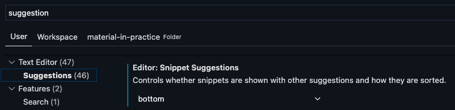

# Convert arrays to human-readable lists

https://www.amitmerchant.com/how-to-convert-arrays-to-human-readable-lists-in-javascript/

```ts
const books = [
    'Harry Potter',
    'Bhagavad Gita',
    'The Alchemist',
    'Birthday Girl'
]

const listFormatter = new Intl.ListFormat('en-GB', {
    style: 'short',
    type: 'disjunction'
})

console.log(listFormatter.format(books));
// Harry Potter, Bhagavad Gita, The Alchemist, or Birthday Girl
```

#  Footnotes now supported in Markdown fields

https://github.blog/changelog/2021-09-30-footnotes-now-supported-in-markdown-fields/

```md
Here is a simple footnote[^1]. With some additional text after it.

[^1]: My reference.
```


# `RouteProps` & `RouteComponentProps`

https://www.pluralsight.com/guides/react-router-typescript

We see that a Route is a React.Component that receives props in the shape of RouteProps. It then renders the component provided to it by component prop and defines what props it will pass to that component: RouteComponentProps.

# A Complete Guide to Testing React Hooks

https://www.toptal.com/react/testing-react-hooks-tutorial

# Download with `<a></a>`

https://shkspr.mobi/blog/2021/08/to-download-this-page-click-here/

```html
<a href="" download="this.html">Download this page</a>

<a href="/pictures/kitten.jpg" download>Download a kitten photo!!!</a>

<a href="/6f12ec75-c4ff-401e-a542" download="puppy.png">Download a random puppy!</a>
```

# A `setTimeout` demo in create-snowpack-app

```ts
const [count, setCount] = useState(0);

useEffect(() => {
  const timer = setTimeout(() => setCount(count + 1), 1000);
  return () => clearTimeout(timer);
}, [count, setCount]);
```

# A snippet of `useContext`

```ts
export const useAuth = () => useContext(AuthContext);
```

# React Children And Iteration Methods

https://www.smashingmagazine.com/2021/08/react-children-iteration-methods/


- The `React.Children` utility methods. We saw two of them: `React.Children.map` to see how to use it to make compound components, and `React.Children.toArray` in depth.
- We saw how `React.Children.toArray` converts opaque children prop — which could be either object, array or function — into a flat array, so that one could operate over it in required manner — sort, filter, splice, etc…
- We learned that `React.Children.toArray` doesn’t traverse through React Fragments.
- We learned about an open-source package called `react-keyed-flatten-children` and understood how it solves the problem.
- We saw that `Children` utilities are in maintenance mode because they do not compose well.

# New shortcut for any GitHub repo

Press <kbd>.</kbd> on any GitHub repo to open it in a browser builtin VS Code.

# Protected Routes in React

YouTube: https://www.youtube.com/watch?v=Y0-qdp-XBJg

CodeSandBox: https://codesandbox.io/s/react-protected-routes-forked-vrpc7?file=/src/protected.route.js

```ts
function App() {
  return (
    <div className="App">
      <Switch>
        <Route exact path="/" component={LandingPage} />
        <ProtectedRoute path="/app" component={AppLayout} />
        <Route path="*" component={() => "404 NOT FOUND"} />
      </Switch>
    </div>
  );
}


export const ProtectedRoute = ({ component: Component, ...rest }) => {
  return (
    <Route
      {...rest}
      render={(props) => {
        if (auth.isAuthenticated()) {
          return <Component {...props} />;
        } else {
          return (
            <Redirect
              to={{
                pathname: "/",
                state: {
                  // access location from "props", instead of "useHistory"
                  from: props.location 
                }
              }}
            />
          );
        }
      }}
    />
  );
};
```

# Git `switch` and `restore`

https://www.banterly.net/2021/07/31/new-in-git-switch-and-restore/

Checkout can also:

```sh
git checkout develop // brach
git checkout f8c540805b7e... // commit hash
git checkout -- test.txt // file name to restore it with the latest commit
```

Suppose `HEAD` is `develop`, the following command will restore the file with the latest commit in `main` brach:

```sh
git checkout main -- test.text
```

It's due to the [doc in git](https://git-scm.com/docs/git-checkout)

`switch` to a new brach

```sh
git switch develop
```

and commit

```
git switch -d 👈 f8c540805b7e16753c65619ca3d7514178353f39
```

or create a brach and switch to it

```sh
git switch -c 👈 new_branch
```

`restore` a file

```sh
git restore -- test.txt
```

# CSS 繁简转换

CSS 命令 ，可以让网站字体从简体变成繁体。

```css
font-variant-east-asian: traditional;
```

# `<input />` value

By default, the type of input's value is `string`.

Accessing `valueAsDate` and `valueAsNumber`, it will return intended type directly.

```ts
<input
  onChange={(event) => console.log(event.target.valueAsDate)}
  onChange={(event) => console.log(event.target.valueAsNumber)}
/>
```

# `useMemo` is not restricted to use on the most top of code

```
export const useTodosQuery = () => {
  const queryInfo = useQuery(['todos'], fetchTodos)

  return {
    ...queryInfo,
    data: React.useMemo( 👈
      () => queryInfo.data?.map((todo) => todo.name.toUpperCase()),
      [queryInfo.data]
    ),
  }
}

const transformTodoNames = (data: Todos) =>
  data.map((todo) => todo.name.toUpperCase())

export const useTodosQuery = () =>
  useQuery(['todos'], fetchTodos, {
    // ✅ memoizes with useCallback
    select: React.useCallback( 👈
      (data: Todos) => data.map((todo) => todo.name.toUpperCase()),
      []
    ),
  })
```

# Debug setting for CRA in VS Code

```json
{
  "type": "pwa-chrome",
  "request": "launch",
  "name": "Chrome",
  "skipFiles": ["node_modules"],
  "url": "http://localhost:3000",
  "webRoot": "${workspaceFolder}/src"
}
```

# `<input />` events tips

When listening to value changes mind that:

❌ Cross mark `change` event doesn't emit unless user e.g. leaves the input

❌ Cross mark `keypress`/`keydown` doesn't emit eg. when the input is changed with a mouse click

✅ White heavy check mark but `input` event does emit every time user updates the field

https://twitter.com/stackblitz/status/1416033954034036745

# Accessing `NODE_ENV`

https://stackoverflow.com/questions/45194598/using-process-env-in-typescript

> There's no guarantee of what (if any) environment variables are going to be available in a Node process - the NODE_ENV variable is just a convention that was popularised by Express, rather than something built in to Node itself. As such, it wouldn't really make sense for it to be included in the type definitions. Instead, they define process.env like this:

```ts
export interface ProcessEnv {
    [key: string]: string | undefined
}
```

> Which means that process.env can be indexed with a string in order to get a string back (or undefined, if the variable isn't set). To fix your error, you'll have to use the index syntax:

```ts
let env = process.env["NODE_ENV"]; // 👈 That's it.
```

# VS Code IntelliSense

Moving "Auto Import" statement to the very top of IntelliSense menu.



# `<fieldset />`

Grouping and manipulating the relevant inputs together.

https://developer.mozilla.org/en-US/docs/Web/HTML/Element/fieldset

# Serving sharp images to high density screens

https://jakearchibald.com/2021/serving-sharp-images-to-high-density-screens/

Key points: AVIF & WebP

```html
<picture>
  <source
    type="image/avif"
    media="(-webkit-min-device-pixel-ratio: 1.5)"
    srcset="2x-800.avif 800w, 2x-1200.avif 1200w, 2x-1598.avif 1598w"
    sizes="
      (min-width: 1066px) 743px,
      (min-width: 800px) calc(75vw - 57px),
      100vw
    "
  />
  <source
    type="image/webp"
    media="(-webkit-min-device-pixel-ratio: 1.5)"
    srcset="2x-800.webp 800w, 2x-1200.webp 1200w, 2x-1598.webp 1598w"
    sizes="
      (min-width: 1066px) 743px,
      (min-width: 800px) calc(75vw - 57px),
      100vw
    "
  />
  <source
    media="(-webkit-min-device-pixel-ratio: 1.5)"
    srcset="2x-800.jpg 800w, 2x-1200.jpg 1200w, 2x-1598.jpg 1598w"
    sizes="
      (min-width: 1066px) 743px,
      (min-width: 800px) calc(75vw - 57px),
      100vw
    "
  />
  <source type="image/avif" srcset="1x-743.avif" />
  <source type="image/webp" srcset="1x-743.webp" />
  
</picture>
```

# How to Dynamically Import ECMAScript Modules

https://dmitripavlutin.com/ecmascript-modules-dynamic-import/

```ts
// namedConcat.js
export const concat = (paramA, paramB) => paramA + paramB;

async function loadMyModule() {
  const { concat } = await import('./namedConcat.js');  concat('b', 'c'); // => 'bc'
}
```

```ts
// defaultConcat.js
export default (paramA, paramB) => paramA + paramB;

async function loadMyModule() {
  const { default: defaultImport } = await import('./defaultConcat.js');
  defaultImport('b', 'c'); // => 'bc'
}
```

# ES2021

https://h3manth.com/ES2021/

Logical Assignment Operators

```ts
//"Or Or Equals"
x ||= y;
x || (x = y);

// "And And Equals"
x &&= y;
x && (x = y);

// "QQ Equals"
x ??= y;
x ?? (x = y);

const updateID = user => {

  // We can do this
  if (!user.id) user.id = 1

  // Or this
  user.id = user.id || 1

  // Or use logical assignment operator.
  user.id ||= 1
}

function setOpts(opts) {
  opts.cat ??= 'meow'
  opts.dog ??= 'bow';
}

setOpts({ cat: 'meow' })
```

Numeric Separators

```ts
1_000_000_000           // Ah, so a billion
101_475_938.38          // And this is hundreds of millions

let fee = 123_00;       // $123 (12300 cents, apparently)
let fee = 12_300;       // $12,300 (woah, that fee!)
let amount = 12345_00;  // 12,345 (1234500 cents, apparently)
let amount = 123_4500;  // 123.45 (4-fixed financial)
let amount = 1_234_500; // 1,234,500

0.000_001 // 1 millionth
1e10_000  // 10^10000 -- granted, far less useful / in-range...
0xA0_B0_C0;
```

Promise.any and AggregateError

```ts
Promise.any([
  fetch('https://v8.dev/').then(() => 'home'),
  fetch('https://v8.dev/blog').then(() => 'blog'),
  fetch('https://v8.dev/docs').then(() => 'docs')
]).then((first) => {
  // Any of the promises was fulfilled.
  console.log(first);
  // → 'home'
}).catch((error) => {
  // All of the promises were rejected.
  console.log(error);
});
```
String.prototype.replaceAll

```ts
// String.prototype.replaceAll(searchValue, replaceValue)

'x'.replace('', '_');
// → '_x'

'xxx'.replace(/(?:)/g, '_');
// → '_x_x_x_'

'xxx'.replaceAll('', '_');
// → '_x_x_x_'
```

WeakRefs and FinalizationRegistry Objects

```ts
let target = {};
let wr = new WeakRef(target);

//wr and target aren't the same


// Creating a new registry
const registry = new FinalizationRegistry(heldValue => {
  // ....
});

registry.register(myObject, "some value", myObject);
// ...some time later, if you don't care about `myObject` anymore...
registry.unregister(myObject);
```

# Optional chain tip

https://swizec.com/blog/a-surprising-feature-of-javascript-optional-chaining/

```ts
object?.deepProp?.[console.log("runs if deepProp defined")]
```

# The extended types can be narrower than its parent ones only

```ts
interface Base {
  common: string // 👉 string | boolean will makes the Ex works
}

/**
 * Interface 'Ex' incorrectly extends interface 'Base'.
 *  Types of property 'common' are incompatible.
 *   Type 'boolean' is not assignable to type 'string'.(2430)
*/
interface Ex extends Base {
  common: boolean;
}
```

# Reminds on Union and Intersection Types in TypeScript

## What's Union Types

Described in the document:

https://www.typescriptlang.org/docs/handbook/2/everyday-types.html#defining-a-union-type

> A union type is a type formed from two or more other types, representing values that may be any one of those types.

and: 

https://www.tslang.cn/docs/handbook/advanced-types.html

> 联合类型表示一个值可以是几种类型之一。
> 
> ...
> 
> 如果一个值是联合类型，我们只能访问此联合类型的所有类型里**共有**的成员。

```ts
interface Bird {
    fly();
    layEggs();
}

interface Fish {
    swim();
    layEggs();
}

function getSmallPet(): Fish | Bird {
    // ...
}

let pet = getSmallPet();
pet.layEggs(); // okay
pet.swim();    // errors
```

> 如果一个值的类型是 A | B，我们能够 确定的是它包含了 A 和 B中共有的成员。 这个例子里， Bird具有一个 fly成员。 我们不能确定一个 Bird | Fish类型的变量是否有 fly方法。 如果变量在运行时是 Fish类型，那么调用 pet.fly()就出错了。

It's explained with one more example in document:

> It might be confusing that a union of types appears to have the intersection of those types’ properties. This is not an accident - the name union comes from type theory. The union number | string is composed by taking the union of the values from each type. Notice that given two sets with corresponding facts about each set, only the intersection of those facts applies to the union of the sets themselves. For example, if we had a room of tall people wearing hats, and another room of Spanish speakers wearing hats, after combining those rooms, the only thing we know about every person is that they must be wearing a hat.

## As same key with different types happens

### For Intersection Types

```ts
// X receives THREE properties: `name`, `age`, and `gender`.
// Age props with different types
type X = {
  name: string;
  age: number;
} & {
  gender: 'M' | "F"
  age: string
}

declare const x: X;

// Age will receives `never` types, with error:
// Type 'string' is not assignable to type 'never'.(2322)
x.age = '' 
```

### For Union Types

```ts
// X receives ONE property: `age`.
// Age props with different types
type X = {
  name: string;
  age: number;
} | {
  gender: 'M' | "F"
  age: string
}

declare const x: X;

// Age will receives `string | number` types, without error.
x.age = '' 
```

# 3 Useful TypeScript Patterns to Keep in Your Back Pocket

https://spin.atomicobject.com/2021/05/11/3-useful-typescript-patterns/

## Pattern 1: Mapped Types 👍

```ts
type Names = "Bob" | "Bill" | "Ben";
type JobTitles = "Welder" | "Carpenter" | "Plumber";

const JobAssignments: { [Key in Names]: JobTitles } = {
  Bob: "Welder",
  Bill: "Carpenter",
  Ben: "Plumber"
};
```

## Pattern 2: Function Overloading

```ts
function inputDoubler(input: string): string;
function inputDoubler(input: number): number;

function inputDoubler(input: string | number) {
  if (typeof input === "string"){
    return `${input}${input}`;
  } else {
    return input * 2;
  }
};
```

## Pattern 3: Custom Type Guards

```ts
function isPizza (food: Pizza | Burrito): food is Pizza {
  return (<Pizza>food).ingredients.topping !== undefined;
  // Or
  return (food as Pizza).ingredients.topping !== undefined;
};
```

# React uncontrolled input issue

https://reactjs.org/docs/forms.html#controlled-input-null-value

For the error message following:

```sh
Warning: A component is changing a controlled input to be uncontrolled. This is likely caused by the value changing from a defined to undefined, which should not happen. Decide between using a controlled or uncontrolled input element for the lifetime of the component. More info: https://reactjs.org/link/controlled-components
```

Specifying the value prop on a controlled component prevents the user from changing the input unless you desire so. If you’ve specified a value but the input is still editable, you may have accidentally set value to undefined or null.

The following code demonstrates this. (The input is locked at first but becomes editable after a short delay.)

```ts
ReactDOM.render(<input value="hi" />, mountNode);

setTimeout(function() {
  ReactDOM.render(<input value={null} />, mountNode);
}, 1000);
```

# Enums

- A Enum is a set of named constants.
- Enum value can be numeric, string, or [computed](https://www.typescriptlang.org/docs/handbook/enums.html#computed-and-constant-members).
- Technically enums can be mixed with [string and numeric](https://www.typescriptlang.org/docs/handbook/enums.html#heterogeneous-enums) members, but it's not clear to do it

## Enums at compile time

https://www.typescriptlang.org/docs/handbook/enums.html#enums-at-compile-time

Even though Enums are real objects that exist at runtime, the `keyof` keyword works differently than you might expect for typical objects. Instead, use `keyof typeof` to get a Type that represents all Enum keys as strings.

```ts
enum LogLevel {
  ERROR,
  WARN,
  INFO,
  DEBUG,
}

/**
 * This is equivalent to:
 * type LogLevelStrings = 'ERROR' | 'WARN' | 'INFO' | 'DEBUG';
 */
type LogLevelStrings = keyof typeof LogLevel;

function printImportant(key: LogLevelStrings, message: string) {
  const num = LogLevel[key];
  if (num <= LogLevel.WARN) {
    console.log("Log level key is:", key);
    console.log("Log level value is:", num);
    console.log("Log level message is:", message);
  }
}
printImportant("ERROR", "This is a message");
```

## Reverse mappings

https://www.typescriptlang.org/docs/handbook/enums.html#reverse-mappings

```ts
enum Enum {
  A,
}

let a = Enum.A;
let nameOfA = Enum[a]; // "A"
```

TypeScript compiles this down to the following JavaScript:

```ts
"use strict";
var Enum;
(function (Enum) {
    Enum[Enum["A"] = 0] = "A";
})(Enum || (Enum = {}));
let a = Enum.A;
let nameOfA = Enum[a]; // "A"
```

⚠️ String enum members DO NOT get a reverse mapping generated at all.

## Objects vs Enums

https://www.typescriptlang.org/docs/handbook/enums.html#objects-vs-enums

In modern TypeScript, you may not need an enum when an object with as const could suffice:

```ts
const enum EDirection {
  Up,
  Down,
  Left,
  Right,
}

const ODirection = {
  Up: 0,
  Down: 1,
  Left: 2,
  Right: 3,
} as const;

EDirection.Up;
           
(enum member) EDirection.Up = 0

ODirection.Up;
           
(property) Up: 0

// Using the enum as a parameter
function walk(dir: EDirection) {}

// type Typeof = {
//   readonly Up: 0;
//   readonly Down: 1;
//   readonly Left: 2;
//   readonly Right: 3;
// };
type Typeof = typeof ODirection;

// type Keyof = "Up" | "Down" | "Left" | "Right"
type Keyof = keyof typeof ODirection;

type LeftRight = typeof ODirection["Left" | "Right"];
const leftRight: LeftRight = 2;

// type TypeofKeyof = 0 | 1 | 2 | 3
type TypeofKeyof = typeof ODirection[keyof typeof ODirection];

// It requires an extra line to pull out the keys
type Direction = typeof ODirection[keyof typeof ODirection];
function run(dir: Direction) {}

walk(EDirection.Left);
run(ODirection.Right);
```

> The biggest idea is not only to differentiate object and enum, but also to explain how `typeof`and `keyof` works.

```ts
const people = {
  name: "Peter",
  age: 9,
}

type People = typeof people; // { name: string; age: number;}
type KeyofPeople = keyof People; // "name" | "age"
type TypeofPeople = typeof people[KeyofPeople]; // string | number
```

# TypeScript Config for `import` statement shortcut

https://www.typescriptlang.org/docs/handbook/module-resolution.html#base-url

```json
{
  "compilerOptions": {
    "baseUrl": "src"
  },
}

```

The above configuration makes:

```ts
import { Actions, Summary } from "./src/components";
```

as

```ts
import { Actions, Summary } from "components";
```

# Google layout demonstration

## Grid

Implemented side aligned grid with as less as two element.

```html
<ul class="Bgzgmd">
  <li>
    <a href="" target="_blank">帮助</a>
  </li>
  <li>
    <a href="" target="_blank">隐私权</a>
  </li>
  <li>
    <a href="" target="_blank">条款</a>
  </li>
</ul>
```

```css
.Bgzgmd {
  margin: 8px -16px; // 👈 negative margin
}

.Bgzgmd li {
    margin: 0;
}

.Bgzgmd a {
    padding: 6px 16px; // 👈  padding
}
```


#  HTML Tips

https://markodenic.com/html-tips/

## The `loading=lazy` attribute

Performance tip. You can use the loading=lazy attribute to defer the loading of the image until the user scrolls to them.

```html        

```

## Email, call, and SMS links:

```html  
<a href="mailto:{email}?subject={**subject**}&body={content}">
  Send us an email
</a>

<a href="tel:{phone}">
  Call us
</a>

<a href="sms:{phone}?body={content}">
  Send us a message
</a>           
```
## Ordered lists `start` attribute.

Use the `start` attribute to change the starting point for your ordered lists.

```html
<ol start="11">
<li>HTML</li>
<li>CSS</li>
</ol>
```

## The `meter` element

You can use the `meter` element to display quantities. No JavaScript/CSS needed.

```html
<label for="value1">Low</label>
<meter id="value1" min="0" max="100" low="30" high="75" optimum="80" value="25"></meter>

<label for="value2">Medium</label>
<meter id="value2" min="0" max="100" low="30" high="75" optimum="80" value="50"></meter>

<label for="value3">High</label>
<meter id="value3" min="0" max="100" low="30" high="75" optimum="80" value="80"></meter>
```

## HTML Native Search

```html
<div class="wrapper">
  <h1>
    Native HTML Search
  </h1>
  
  <input list="items">
  
  <datalist id="items">
    <option value="Marko Denic">
    <option value="FreeCodeCamp">
    <option value="FreeCodeTools">
    <option value="Web Development">
    <option value="Web Developer">
  </datalist>
</div>
```

## Fieldset Element

You can use the `fieldset` element to group several controls as well as labels (`label`) within a web form.

```html
<form>
  <fieldset>
    <legend>Choose your favorite language</legend>

    <input type="radio" id="javascript" name="language">
    <label for="javascript">JavaScript</label><br/>

    <input type="radio" id="python" name="language">
    <label for="python">Python</label><br/>

    <input type="radio" id="java" name="language">
    <label for="java">Java</label>
  </fieldset>
</form>
```

## Base Element

If you want to open all links in the document in a new tab, you can use `base` element:

```html
<head>
   <base target="_blank">
</head>
<!-- This link will open in a new tab. -->
<div class="wrapper">
  This link will be opened in a new tab: &nbsp;
  <a href="https://freecodetools.org/">
    Free Code Tools
  </a>

  <p>
    Read more: <br><a href="https://developer.mozilla.org/en-US/docs/Web/HTML/Element/base">
    MDN Documentation
    </a>
  </p>
</div>
```

## Favicon cache busting

To refresh your website’s favicon you can force browsers to download a new version by adding `?v=2` to the filename.

This is especially helpful in production to make sure the users get the new version.

```html
<link rel="icon" href="/favicon.ico?v=2" />           
```
## The `spellcheck` attribute

Use the spellcheck attribute to define whether the element may be checked for spelling errors.

```html
<label for="input1">spellcheck="true"</label>
<input type="text" id="input1" spellcheck="true">

<label for="input2">spellcheck="false"</label>
<input type="text" id="input2" spellcheck="false">
```

## Native HTML sliders

You can use `<input type="range">` to create sliders.

```html
<label for="volume">Volume: </label>
<input type="range" id="volume" name="volume" min="0" max="20">

<label for="result">Your choice: </label>
<input type="number" id="result" name="result">
```

## HTML Accordion

You can use the `details` element to create a native HTML accordion.

```html
<div class="wrapper">
  <details>
    <summary>
      Click me to see more details
    </summary>

    <p>
      Lorem ipsum dolor sit amet consectetur adipisicing elit.
    </p>
  </details>
</div>
```

## `mark` tag

You can use the `<mark>` tag to highlight text.

## `download` attribute

You can use the `download` attribute in your links to download the file instead of navigating to it.

```html
<a href='path/to/file' download>
  Download
</a>
```

##  Performance tip

Use the `.webp` image format to make images smaller and boost the performance of your website.

```html
<picture>
  <!-- load .webp image if supported -->
  <source srcset="logo.webp" type="image/webp">
  
  <!-- 
	Fallback if `.webp` images or <picture> tag 
	not supported by the browser.
  -->
  
</picture>           
```

## input type="search"

Use the `type="search"` for your search inputs and you get the “clear” button for free.

# Journey of Improving React App Performance

https://medium.com/technogise/journey-of-improving-react-app-performance-by-10x-9195d4b483d4

### Remove all Inline Functions

```ts
class Parent extends Component {
  render() {
    return (
      <Child
        onClick={() => console.log('You clicked!')}
     />
    );
  }
}
```

1. It will always trigger a re-render of the component even if there is no change in the props.
2. It increases the memory footprint of the app. (Refer: Function spaces in Memory snapshot of Firefox)

### Conditional rendering of the components

```ts
class Parent extends Component {
  render() {
    return (
      <Modal show={isOpen}>
        <Modal.Header>
          Hello
        </Modal.Header>
        <Modal.Body>
          I am a Modal
        </Modal.Body>
      </Modal>
    );
}
```
Avoided rendering these components until they are needed i.e. [Conditional Rendering](https://reactjs.org/docs/conditional-rendering.html).

This decreased the memory footprint from 500Mb to 150Mb. 😄

Improving above example as below:

```ts
class Parent extends Component {
  render() {
    return (
      <Modal show={isOpen}>
        <Modal.Header>
          Hello
        </Modal.Header>
        <Modal.Body>
          I am a Modal
        </Modal.Body>
      </Modal>
    );
}
```

### Remove unnecessary awaits and use Promise.all() wherever applicable

```ts
const userSubscription = getUserSubscription();
const userDetails = getUserDetails();
const userNotifications = getUserNotifications();
```

Solution: We identified that most of the API calls can be made to execute in parallel. So, we used `Promise.all()` to help us send all these API calls parallelly.

This decreased the initial page load time and other pages by 30%.

```ts
const [
  userSubscription,
  userDetails,
  userNotifications
] = await Promise.all([
  getUserSubscription(),
  getUserDetails(),
  getUserNotifications()
]);
```

# navigate directories faster with bash

https://mhoffman.github.io/2015/05/21/how-to-navigate-directories-with-the-shell.html

- `~` Home directory
- `-` Previous directory
- `!$` is an alias for the last argument of the previous command(⚠️ DO NOT WORK in fish)

# React 17 adds support for KeyboardEvent.code property to SyntheticEvent

https://blog.saeloun.com/2021/04/23/react-keyboard-event-code

```ts
// Before
const handleKeyDown = (event) => {
    const key = event.nativeEvent.code;
    switch (key) {
      case 'KeyW':
        //moveTop();
        break;
      case 'KeyA':
        //moveLeft();
        break;
      case 'KeyS':
        //moveDown();
        break;
      case 'KeyD':
        //moveRight();
        break;
      default:
      //custom logic  
    }
  }

// After
const handleKeyDown = (event) => {
    // We replaced the native event with the synthetic keyboard event
    const key = event.code; 
    switch (key) {
      case 'KeyW':
        //moveTop();
        break;
      case 'KeyA':
        //moveLeft();
        break;
      case 'KeyS':
        //moveDown();
        break;
      case 'KeyD':
        //moveRight();
        break;
      default:
      //custom logic  
    }
  }
```

# Yarn WorkSpace

https://halftheopposite.dev/post/app-yarn-typescript-esbuild-part-1
https://halftheopposite.dev/post/app-yarn-typescript-esbuild-part-2
https://halftheopposite.dev/post/app-yarn-typescript-esbuild-part-3
https://halftheopposite.dev/post/app-yarn-typescript-esbuild-part-going-further

```
my-app/
├─ node_modules/
├─ packages/
│  ├─ app/
│  │  ├─ package.json
│  ├─ common/
│  │  ├─ package.json
│  ├─ server/
│  │  ├─ package.json
├─ package.json
├─ tsconfig.json
├─ yarn.lock
```

```sh
{
  "name": "my-app",
  "version": "1.0",
  "license": "UNLICENSED",
  "private": true, // Required for Yarn WorkSpace
  "workspaces": ["packages/*"],
  "devDependencies": {
    "typescript": "^4.2.3"
  },
  "scripts": {
    "app": "yarn workspace @my-app/app",
    "common": "yarn workspace @my-app/common",
    "server": "yarn workspace @my-app/server"
  }
}
```

`package.json` in every WorkSpace module
```sh
{
  "name": "@my-app/app",
  "version": "0.1.0",
  "license": "UNLICENSED",
  "private": true
}
```

```sh
yarn add -D -W typescript // -W to install the dependency in WorkSpace root
```

# Styled Components Best Practices

https://www.robinwieruch.de/styled-components

## Use `css` utility

```js
import styled, { css } from 'styled-components';
 
const red = css`
  color: red;
`;
 
const Headline = styled.h1`
  ${red}
 
  font-size: 20px;
`;
```

## Single/Multiple Styled Components

On the left side of spectrum

```js
const Section = styled.section`
  border-bottom: 1px solid grey;
  padding: 20px;
`;
 
const Headline = styled.h1`
  color: red;
`;
 
const Text = styled.span`
  padding: 10px;
`;
 
const Content = ({ title, children }) => {
  return (
    <Section>
      <Headline>{title}</Headline>
 
      <Text>{children}</Text>
    </Section>
  );
};
```

On the other side of the spectrum,

```js
const Container = styled.section`
  border-bottom: 1px solid grey;
  padding: 20px;
 
  h1 {
    color: red;
  }
 
  .text {
    padding: 10px;
  }
`;
 
const Content = ({ title, children }) => {
  return (
    <Container>
      <h1>{title}</h1>
 
      <span className="text">{children}</span>
    </Container>
  );
};
```


# How to use CSS3 variables in styled-components

https://epicreact.dev/css-variables/

```css
body[data-theme='light'] {
  --colors-primary: deeppink;
  --colors-background: white;
}
body[data-theme='dark'] {
  --colors-primary: lightpink;
  --colors-background: black;
}
```

```ts
const PrimaryText = styled.div({
  padding: 20,
  color: 'var(--colors-primary)',
  backgroundColor: 'var(--colors-background)',
})
```

# Handling Static Assets in Jest

https://jestjs.io/docs/webpack#handling-static-assets

```json
// package.json
{
  "jest": {
    "moduleNameMapper": {
      "\\.(jpg|jpeg|png|gif|eot|otf|webp|svg|ttf|woff|woff2|mp4|webm|wav|mp3|m4a|aac|oga)$": "<rootDir>/__mocks__/fileMock.js",
      "\\.(css|less)$": "<rootDir>/__mocks__/styleMock.js"
    }
  }
}
```

And the mock files themselves:

```ts
// __mocks__/styleMock.js

module.exports = {};
```

```ts
// __mocks__/fileMock.js

module.exports = 'test-file-stub';
```

> See also: [Mocking CSS Modules](https://jestjs.io/docs/webpack#mocking-css-modules)

# ES2021 Logical assignment operators

https://exploringjs.com/impatient-js/ch_operators.html#logical-assignment-operators

Logical assignment operators work differently from other compound assignment operators:

| Assignment operator | Equivalent to  | Only assigns if a is |
| ------------------- | -------------- | -------------------- |
| a \|\|= b           | a \|\| (a = b) | Falsy                |
| a &&= b             | a && (a = b)   | Truthy               |
| a ??= b             | a ?? (a = b)   | Nullish              |

Why is `a||= b` equivalent to the following expression?
```ts
a || (a = b)
```

Why not to this expression?

```ts
a = a || b
```

The former expression has the benefit of short-circuiting: The assignment is only evaluated if a evaluates to false. Therefore, the assignment is only performed if it’s necessary. In contrast, the latter expression always performs an assignment.

# MacOS

In LaunchPad, holding <kbd>Option</kbd> key can uninstall apps instantly.

# React Native 0.64

## Inline Requires enabled by default for better performance.

Before:

```ts
import { MyFunction } from 'my-module';

const MyComponent = (props) => {
  const result = MyFunction();

  return (<Text>{result}</Text>);
};
```

After:

```ts
const MyComponent = (props) => {
  const result = require('my-module').MyFunction();

  return (<Text>{result}</Text>);
};
```

## React 17

The main change is a new JSX transform enabling files to no longer need to import `React` to be able to use JSX.

# React Types

https://reactnative.dev/docs/flatlist#listemptycomponent

- React Component (e.g. SomeComponent)
- React element (e.g. <SomeComponent />)

# `addEventListener` support abort

https://developer.mozilla.org/en-US/docs/Web/API/EventTarget/addEventListener#parameters

https://jakearchibald.com/2021/function-callback-risks/

```ts
const controller = new AbortController();
const { signal } = controller;

el.addEventListener('mousemove', callback, { signal });
el.addEventListener('pointermove', callback, { signal });
el.addEventListener('touchmove', callback, { signal });

// Later, remove all three listeners:
controller.abort();
```

# Installing react-native-unimodules

https://docs.expo.io/bare/installing-unimodules/

This library contains infrastructure and a small set of foundational libraries and interfaces that are commonly depended on by other modules. You can install react-native-unimodules in any react-native app, and once it is installed you can use most of the libraries from the Expo SDK, like expo-camera, expo-media-library and many more.

> If you are creating a new project, we recommend using `npx create-react-native-app` (https://github.com/expo/create-react-native-app) instead of `npx react-native init` because it will handle the following configuration for you automatically.

# Using Libraries in React Native

https://reactnative.dev/docs/libraries

**React Native Directory** https://reactnative.directory/

## Linking Native Code on iOS

React Native uses CocoaPods to manage iOS project dependencies and most React Native libraries follow this same convention.

Run `pod install` in our ios directory in order to link it to our native iOS project. A shortcut for doing this without switching to the ios directory is to run:

```ts
npx pod-install
```

Once this is complete, re-build the app binary to start using your new library:
```ts
npx react-native run-ios
```

## Linking Native Code on Android

React Native uses Gradle to manage Android project dependencies. After you install a library with native dependencies, you will need to re-build the app binary to use your new library:

```ts
npx react-native run-android
```

# `$$` in DevTools

In DevTools, `$$` is shorthand for

```ts
Array.from(document.querySelectorAll())
```

Leran more https://developers.google.com/web/tools/chrome-devtools/console/utilities

# Building React Components Using Children Props and Context API

https://blog.soshace.com/en/javascript/building-react-components-using-children-props-and-context-api/

What we need first is React.Children.toArray(children) to always handle children as an array because when there is only one component, it will not be an array by default.

# Re-export a component as default

https://reactjs.org/docs/code-splitting.html#named-exports

```ts
// ManyComponents.js
export const MyComponent = /* ... */;
export const MyUnusedComponent = /* ... */;

// MyComponent.js
export { MyComponent as default 👈 } from "./ManyComponents.js";
```

# Generic type support default type

https://www.smashingmagazine.com/2021/01/dynamic-static-typing-typescript/


```ts
type ServerRequest<Met extends Methods, Par extends string = string> = {
  method: Met;
  params: Record<Par, string>;
};
```

# `Intl` API

As a bonus and because `Intl` is part of `ECMAScript`, it is also available in Node.js. You will want to be more careful with defaults when working on server though. The time zone, for example, is going to be where the server is located, not the time zone of your user. I recommend working in `UTC` on servers and using users’ time zones when displaying the datetime.

# Static property for both class component & function component

```ts
class C extents Component {
  static sharedElement = (route, otherRoute, showing) => {}
}

const C = () => (<></>)
C.sharedElement = (route, otherRoute, showing) => {}
```

# Use derived types

```ts
const theme = {
  color: {},
  spacing: {},
};

export type Theme = typeof theme;
```

# Search and replace in VSCode

https://code.visualstudio.com/docs/editor/codebasics#_advanced-search-options

In the two input boxes below the search box, you can enter patterns to include or exclude from the search. If you enter example, that will match every folder and file named example in the workspace. If you enter ./example, that will match the folder example/ at the top level of your workspace. Use , to separate multiple patterns. Paths must use forward slashes. You can also use glob syntax:

- `*` to match one or more characters in a path segment
- `?` to match on one character in a path segment
- `**` to match any number of path segments, including none
- `{}` to group conditions (for example {\*\*/\*.html,\*\*/\*.txt} matches all HTML and text files)
- `[]` to declare a range of characters to match (example.[0-9] to match on example.0, example.1, …)


# Tips from React Native document

## Resize mode for `<Image>`

https://reactnative.dev/docs/image#resizemode

Determines how to resize the image when the frame doesn't match the raw image dimensions. Defaults to cover.

- `cover`: Scale the image uniformly (maintain the image's aspect ratio) so that both dimensions (width and height) of the image will be equal to or larger than the corresponding dimension of the view (minus padding).

- `contain`: Scale the image uniformly (maintain the image's aspect ratio) so that both dimensions (width and height) of the image will be equal to or less than the corresponding dimension of the view (minus padding).

- `stretch`: Scale width and height independently, This may change the aspect ratio of the src.

- `repeat`: Repeat the image to cover the frame of the view. The image will keep its size and aspect ratio, unless it is larger than the view, in which case it will be scaled down uniformly so that it is contained in the view.

- `center`: Center the image in the view along both dimensions. If the image is larger than the view, scale it down uniformly so that it is contained in the view.

## Default values of `FlexBox` in React Native

https://reactnative.dev/docs/flexbox#flex-wrap

1. `flexDirection` defaulting to `column` instead of `row`;
2. `alignContent` defaulting to `flex-start` instead of `stretch`;
3. `flexShrink` defaulting to `0` instead of `1`;
4. `flex` parameter only supporting a single number.

## `style` vs `contentContainerStyle` in `ScrollView`

https://stackoverflow.com/questions/52892304/style-vs-contentcontainerstyle-in-scrollview

`ScrollView` is a special kind of View, which has two parts:

1. Container (the grey box), it's the outside View, its height can't exceed 100% of the window height.
2. Content (marked in blue) is the inner part, it can be higher than the window height, it's what's moving inside the container.


ScrollView `style` defines the outer container of the `ScrollView`, e.g its `height` and `relations` to siblings elements

ScrollView `contentContainerStyle` defines the inner container of it, e.g items `alignItems`, `padding`, etc

## On `<ScrollView />`

https://reactnative.dev/docs/scrollview

Keep in mind that ScrollViews **must have a bounded height** in order to work, since they contain unbounded-height children into a bounded container (via a scroll interaction). In order to bound the height of a ScrollView, either set the height of the view directly (discouraged) or make sure all parent views have bounded height. Forgetting to transfer {flex: 1} down the view stack can lead to errors here, which the element inspector makes quick to debug.

`<ScrollView>` vs `<FlatList>` - which one to use?

`ScrollView` renders all its react child components at once, but this has a performance downside.

`FlatList` renders items lazily, when they are about to appear, and removes items that scroll way off screen to save memory and processing time.

`FlatList` is also handy if you want to render separators between your items, multiple columns, infinite scroll loading, or any number of other features it supports out of the box.

## Use `contentContainerStyle` in customer component

https://reactnative.dev/docs/scrollview#contentcontainerstyle

While designing customer component, we can use `contentContainerStyle` to define the component's container style.

```ts
export const C = ({ contentContainerStyle, style }) => (
  <View style={[styles.container, ...contentContainerStyle 👈]}>
    <Text style={[styles.content, ...styles 👈]}>Hello</Text>
  </View>
)

## Set `<Text />` as block

https://reactnative.dev/docs/text

```ts
const TextInANest = () => {
  const titleText = useState("Bird's Nest"); // 👈 useful if need value only,
  const bodyText = useState("This is not really a bird nest.");

  return (
    // <Text /> can be set as block             👇
    <Text style={[styles.titleText, {display: 'flex'}]}>
      {titleText}
    </Text>
  );
};
```

## Styling on `<View />`

https://reactnative.dev/docs/view

Views are designed to be used with StyleSheet for clarity and performance, although inline styles are also supported.

# `useRef` and `setTimeout` in TypeScript

```ts
                          👇                          👇
const timer = useRef<ReturnType<typeof setTimeout>>(null!);

useEffect(() => {
  timer.current = setTimeout(function updater() {
    setCurrent((current + 1) % length);

    timer.current = setTimeout(updater, duration);
  }, duration);
  return () => {
    clearTimeout(timer.current);
  };
}, [current, duration, length]);
```

# Record screen in iOS Simulator

https://stackoverflow.com/questions/25797990/capture-ios-simulator-video-for-app-preview

# `onBlur` and `onFocus` issues of `TextInput`

In Android, the following code will print `undefined`.

```ts
const onFocus = ({ nativeEvent: { text } }) => console.log(text);
const onBlur = ({ nativeEvent: { text } }) => console.log(text);
```

How to fix

1️⃣ access the value from some kind of store.
```ts
const [value, setValue] = useState('');

const onChangeText = (text) => setValue(text);
const onFocus = () => console.log(value);
const onEndEditing = () => console.log(value);
```

2️⃣ use `onEndEditing` instead of `onBlur`

# Query keys from React Query

https://react-query.tanstack.com/guides/query-keys#if-your-query-function-depends-on-a-variable-include-it-in-your-query-key


React Query use query keys to unique the cache for data.

All the variables which effect the query should be listed in the query keys.

**Of array form**

1️⃣ Both of the following query forms work, but the order matters in array form.

2️⃣ The first string type item is ❓ optional, the variables are enough to make the cache invalidate.


```ts
export const useTransferWiseQuote = (initialParams) => {
  const { data: TransferWiseUser } = useQuery(queryKeys.twUser, getTwId);

  const { twCustomerId } = TransferWiseUser;

  const customerId = `tw_customer_id=${twCustomerId}`;

  const [
    {
      sourceAmount, sourceCurrency, targetAmount, targetCurrency,
    },
    setParams,
  ] = useState(initialParams);

  const initialData = useMemo(
    () => ({
      fee: 0,
      formattedEstimatedDelivery: '',
      id: '',
      rate: 0,
      rateType: '',
      targetAmount: 0,
      ...initialParams,
    }),
    [initialParams],
  );
  const amountKey = sourceAmount ? 'sourceAmount' : 'targetAmount';
  const amountValue = sourceAmount || targetAmount;
  const amountString = `${amountKey}=${amountValue}`;
  const sourceCurrencyString = `sourceCurrency=${sourceCurrency}`;
  const targetCurrencyString = `targetCurrency=${targetCurrency}`;
  const joined = [
    customerId,
    amountString,
    sourceCurrencyString,
    targetCurrencyString,
  ].join('&');

  const url = `${ApiEndpointTransferWise}/quotes/v1/getQuote?${joined}`;

  const { error, data } = useQuery(
    [
      queryKeys.twQuote, // 2️⃣  Optional 
      {
        sourceAmount, // 1️⃣ Order does NOT matters
        sourceCurrency,
        targetAmount,
        targetCurrency,
      },
    ],
    () => httpRequest.get(url),
    { initialData },
  );

  const { error, data } = useQuery(
    [
      queryKeys.twQuote, // 2️⃣ Optional 
      sourceAmount, // 1️⃣ Order matters
      sourceCurrency,
      targetAmount,
      targetCurrency,
    ],
    () => httpRequest.get(url),
    { initialData },
  );

  return [data, setParams];
};
```

# `React.memo` hint

https://www.youtube.com/watch?v=IuXpqUxJG90

By default it will only shallowly compare complex objects in the props object. So if a callback is passed as inline arrow function, it will cause a rerender.

Try to avoid use inline arrow function, or wrap it with `useCallback`

# Destructuring Object conditionally

```ts
const conditionallyProperty = {...(bool ? {foo: 'Foo'} : {})};
```

# Define `Enums` in JSDoc

https://stackoverflow.com/questions/19093935/how-to-document-a-string-type-in-jsdoc-with-limited-possible-values

```ts
/**
 * @typedef {"keyvalue" | "bar" | "timeseries" | "pie" | "table"} MetricFormat
 */

/**
 * @param format {MetricFormat}
 */
export function fetchMetric(format) {
    return fetch((`/`), format);
}
```

# Get key types from `Enum`

https://www.typescriptlang.org/docs/handbook/enums.html#enums-at-compile-time

```ts
enum LogLevel {
  ERROR,
  WARN,
  INFO,
  DEBUG,
}

/**
 * This is equivalent to:
 * type LogLevelStrings = 'ERROR' | 'WARN' | 'INFO' | 'DEBUG';
 */
type LogLevelStrings = keyof typeof LogLevel; // 👈  Got it.

function printImportant(key: LogLevelStrings, message: string) {
  const num = LogLevel[key];
  if (num <= LogLevel.WARN) {
    console.log("Log level key is:", key);
    console.log("Log level value is:", num);
    console.log("Log level message is:", message);
  }
}
printImportant("ERROR", "This is a message");
```

# Default parameter in ES6

https://es6.ruanyifeng.com/#docs/function#%E5%8F%82%E6%95%B0%E9%BB%98%E8%AE%A4%E5%80%BC%E7%9A%84%E4%BD%8D%E7%BD%AE

如果传入undefined，将触发该参数等于默认值，null则没有这个效果。

# Styled-Components features not support in React Native

- Note that the `flex` property works like CSS shorthand, and not the legacy `flex` property in React Native. Setting `flex: 1` sets `flexShrink` to `1` in addition to setting `flexGrow` to `1` and `flexBasis` to `0`.
- cannot use the `keyframes` and `createGlobalStyle` helpers since React Native doesn't support `keyframes` or `global` styles.
- You will be warned if you use media queries or nest your CSS.

# Styled Props tips in React Native

The following style props can be used as component props directly.

https://reactnative.dev/docs/view-style-props

Component will be styled with height and box shadow(Android only)

Although TypeScript complains that those two props are not available

```ts
<View 
  height={100} 👈
  elevation={10} 👈 
  style={{backgroundColor: 'white'}} />
```

> It DO NOT work on React Native for web

# Use React Native build-in style types

```ts
type ContainerProps = {
  // available options: ViewStyle | TextStyle | ImageStyle
  contentContainerStyle: ViewStyle; 👈
};

const Container = styled.FlatList<ContainerProps>`
  flex-grow: 0;
  margin: ${({contentContainerStyle: {margin}}) => margin ?? '10'}px;
`;
```

# Styled-components for React Native

### `attrs` method DO NOT support `style` props
```ts
type ViewStyledProps = {
  x?: number;
};

const ViewStyled = styled.View.attrs({x}) => ({
  // The following DO NOT work.
  style: {elevation: x, backgroundColor: 'red'},
}))``;
```

### How to define additional props

```ts
type ViewStyledProps = {
  elevation?: number;
};

const AnimatedViewStyled = styled(Animated.View)
  .attrs<ViewStyledProps 👈 >(props => ({}))<ViewStyledProps 👈 >`
    box-shadow: ${({elevation = 10}) => `0 0 ${elevation}px rgba(255, 0, 0, 0.5)`};
    background-color: white;
  `;
```

# customize component display name

```ts
AnimatedViewStyled.displayName = 'Hello';
```

# Default `backgroundColor` for `<View />` is `#FAFAFA`

# A code style

```ts
export const renderReactions = (
  reactions,
  supportedReactions,
  reactionCounts,
  handleReaction,
) => {
  const reactionsByType = {}; // 👈  a store
  reactions &&
    reactions.forEach(item => {
      if (reactions[item.type] === undefined) {
        return (reactionsByType[item.type] = [item]);
      } else {
        // 👇 update store and return it.
        return (reactionsByType[item.type] = [
          ...reactionsByType[item.type],
          item,
        ]);
      }
    });

  const emojiDataByType = {};
  supportedReactions.forEach(e => (emojiDataByType[e.id] = e));

  const reactionTypes = supportedReactions.map(e => e.id);

  // 👇 map the store to view
  return Object.keys(reactionsByType).map((type, index) =>
    reactionTypes.indexOf(type) > -1 ? (
      <ReactionItem
        key={index}
        type={type}
        handleReaction={handleReaction}
        reactionCounts={reactionCounts}
        emojiDataByType={emojiDataByType}
      />
    ) : null,
  );
};
```

# How to use fonts in ReactNative

https://dev.to/vishalnarkhede/tutorial-how-to-build-a-slack-clone-with-react-native-part-1-37kn

- create `react-native.config.js` in root of project.

  ```ts
  module.exports = {
    assets: ['./assets/fonts/'],
  };
  ```
- place font files in the folder above.
- run `npx react-native link`.
- apply font in style

  ```ts
  const styles = StyleSheet.create({
    title: {
      fontFamily: 'Lato-Regular',
    },
  });
  ```

# non-null assertion operator (the postfix ! character).

# Fix issues on iOS simulator

## Reset simulator

https://stackoverflow.com/questions/51147704/expo-error-installing-or-running-app

1️⃣ **From shell**

```sh
xcrun simctl erase all
```

2️⃣ **From Simulator menu**

Simulator -> `Device` -> `Erase All Contents and Settings`.

## Activate keyboard

- Simulator -> 'I/O' -> `Keyboard` -> `Connect Hardware Keyboard`, or <kbd>⌘+Shift+K</kbd>

# How to access dot file or folder in MacOS

- <kbd>shift</kbd> + <kbd>cmd</kbd> + <kbd>G</kbd> to go to the dot file or folder.
- Use Spotlight

# Fish shell

**Set Fish as default shell in VS Code**

https://stackoverflow.com/questions/60174054/how-does-visual-studio-code-vscode-know-environment-variables-set-in-config

**autosuggestion**

https://fishshell.com/docs/current/index.html#autosuggestions

To accept the autosuggestion (replacing the command line contents), press right arrow or Control+F. To accept the first suggested word, press Alt+→,Right or Alt+F. If the autosuggestion is not what you want, just ignore it: it won't execute unless you accept it.

-    Tab completes the current token. Shift, Tab completes the current token and starts the pager's search mode.
-   Alt+←,Left and Alt+→,Right move the cursor one word left or right (to the next space or punctuation mark), or moves forward/backward in the directory history if the command line is empty. If the cursor is already at the end of the line, and an autosuggestion is available, Alt+→,Right (or Alt+F) accepts the first word in the suggestion.
-    Shift,←,Left and Shift,→,Right move the cursor one word left or right, without stopping on punctuation.
-   ↑ (Up) and ↓ (Down) (or Control+P and Control+N for emacs aficionados) search the command history for the previous/next command containing the string that was specified on the commandline before the search was started. If the commandline was empty when the search started, all commands match. See the history section for more information on history searching.
-   Alt+↑,Up and Alt+↓,Down search the command history for the previous/next token containing the token under the cursor before the search was started. If the commandline was not on a token when the search started, all tokens match. See the history section for more information on history searching.
-   Control+C cancels the entire line.
-   Control+D delete one character to the right of the cursor. If the command line is empty, Control+D will exit fish.
-   Control+U moves contents from the beginning of line to the cursor to the killring.
-   Control+L clears and repaints the screen.
-   Control+W moves the previous path component (everything up to the previous "/", ":" or "@") to the killring.
-   Control+X copies the current buffer to the system's clipboard, Control+V inserts the clipboard contents.
-   Alt+d moves the next word to the killring.
-   Alt+h (or F1) shows the manual page for the current command, if one exists.
-   Alt+l lists the contents of the current directory, unless the cursor is over a directory argument, in which case the contents of that directory will be listed.
-   Alt+p adds the string '| less;' to the end of the job under the cursor. The result is that the output of the command will be paged.
-   Alt+w prints a short description of the command under the cursor.
-   Alt+e edit the current command line in an external editor. The editor is chosen from the first available of the $VISUAL or $EDITOR variables.
-   Alt+v Same as Alt+e.
-   Alt+s Prepends sudo to the current commandline.

# Cold boot virtual android device in Android Studio

# Use 'open' command to open a file with its default browser.

# How to dark mode

Toggle class name to `.lightMode`to fire light mode.

```scss
// by default dark theme

:root {
    --bg-color: #171923;
    --bg-light: #232535;
    --font-color: #c5cddb;
    --font-light: #ffffff;
}

// light theme colors

.lightMode {
  --bg-color: #E8E6DC;
  --bg-light: #DCDACA;
  --font-color: #3D3D3D;
  --font-light: #202020;
}
```

# `package.json`version

- `˜` for patch version. `16.3.x` ✔, but `16.4.0` ❌
- `ˆ`for minor version. `16.x.x` ✔️, but `17.0.0` ❌

https://dev.to/laurieontech/the-anatomy-of-package-json-pi4?utm_source=digest_mailer&utm_medium=email&utm_campaign=digest_email

# Create React App with TypeScript issue

CRA v4 DO NOT support set `path` section in `tsconfig.json`, which can set path alias in 'import' statement. (validated on Dec 2020) https://www.typescriptlang.org/tsconfig#paths

# How to rename Git branch

Learned from GitHub's repository initial tips: `git branch -M main`.

# Add environment variables to CodeSandbox

- Fock from https://codesandbox.io/s/node-http-server-node
- Add variable from `Server Control Panel`. https://codesandbox.io/docs/secrets

# ContextAPI Initiative in twilio-video-app-react

```ts
export const VideoContext = createContext<IVideoContext>(null!); // without 'as'
```

# React native tool port


# Array.prototype.slice

[MDN](https://developer.mozilla.org/en-US/docs/Web/JavaScript/Reference/Global_Objects/Array/slice)

The `slice()` method returns a **shallow copy** of a portion of an array into a **new array object** selected from begin to end (end not included) where begin and end represent the index of items in that array. The original array will not be modified.

# Debug practices

- 对于时间、id等可能为字符串或数值类型的情况，做强转防御。
- 适度抛错，便于QA排查。

# How to Update Angular

```bash
ng update @angular/cli @angular/core
```

# 可观察对象的退订

在 Angular 中，`HttpModule` 或 Rxjs `ajax` 方法不需要退订。因为这方法在请求完成后，会自动触发可观察对象的 `complete` 状态。

**思路**

以 [`flatMap`](https://developer.mozilla.org/en-US/docs/Web/JavaScript/Reference/Global_Objects/Array/flatMap) 为引导，以理解“高阶可观察者”对象.

# Disabled type check temporarily

https://www.typescriptlang.org/docs/handbook/type-checking-javascript-files.html

With the following comments: `// @ts-nocheck`, `// @ts-check`, and `// @ts-ignore`.

**Heads up:** if you have a `tsconfig.json`, JS checking will respect strict flags like `noImplicitAny`, `strictNullChecks`, etc.

# DOM 事件的行内回调形式
行内回调的语句可以拿到 `event` 对象: 

```html
<input onkeyup="peopleStore[1].name = event.target.value" />
```

# Prettier End of Line 

https://prettier.io/docs/en/options.html#end-of-line

```sh
# .prettierrc
{ "endOfLine": "auto" }
```

# Safe area to display in Expo

https://docs.expo.io/versions/latest/sdk/safe-area-context/

```sh
expo install react-native-safe-area-context
```

```ts
import { SafeAreaView } from 'react-native-safe-area-context';

function SomeComponent() {
  return (
    <SafeAreaView>
      <View />
    </SafeAreaView>
  );
}
```

# Git rebase

https://git-scm.com/book/en/v2/Git-Branching-Rebasing

https://git-scm.com/docs/git-rebase


```sh
$ git rebase --onto master server client
```


# Remove a file from Git commit

1. `GitLens => File History`, right click the target commit hash you wanna restore, select `Restore`. Check the result to make sure it is intending one.
2. `git restore <FILE>`, retore it from stages.
3. `git add .`, add the changes to stages.
4. `git commit --amend --no-edit`, amend the last commit without changing the commit message.

**Reason**

The actions from both GitLens `Restore` and Git `git restore` recover the unexpected changes to the original commit. `git add . && git commit --amend` will add the desired files to commit again, without the unexpedted ones.

# Make `yarn golbal add` works

If Yarn is installed with `npm install -g yarn`, it's `bin` will not be added to Windows Environment Variables by default. 

It makes the following error cause:

> 'parcel' is not recognized as an internal or external command, operable program or batch file.

**Howto**

1. `yarn global bin` to retrieve yarn global binary bin, and copy the output
2. Add the path to Windows Environment Variables


# `clamp()` function in CSS

https://developer.mozilla.org/en-US/docs/Web/CSS/clamp

https://caniuse.com/css-math-functions

**How to use**

- Choose a minimum value: E.g. 16px
- Choose a maximum value: E.g. 34px
- Choose a flexible value: E.g. 5vw

```css
h1 {
  font-size: clamp(16px, 5vw, 34px);
}
```


# How Array sort works in JavaScript

```ts
const arr = [1, 5, 2, 7, 0];

const result = arr.sort((a, b) => b - a) // [ 7, 5, 2, 1, 0 ]
```

(a = 1 b = 5) 2⏳ 7 0 👉 [5, 1, 2, 7, 0]

5 (a = 1 b = 2) 7⏳ 0 👉 [5, 2, 1, 7, 0]

(a = 5 b = 2) 1 7⏳ 0 👉 [5, 2, 1, 7, 0]

5 2 (a = 1 b = 7) 0⏳ 👉 [5, 2, 7, 1, 0]

5 (a = 2 b = 7) 1 0⏳ 👉 [5, 7, 2, 1, 0]

(a = 5 b = 7) 2 1 0⏳ 👉 [7, 5, 2, 1, 0]

7 5 2 (a = 1 b = 0)🏁 👉 [7, 5, 2, 1, 0]

https://developer.mozilla.org/en-US/docs/Web/JavaScript/Reference/Global_Objects/Array/sort


# How to await for multiple results in parallel

https://gist.run/?id=da57950803bf00ce555752da6bd7147e&mc_cid=5fa9352dcf&mc_eid=afaf576ce2

```ts
Promise.all([asyncFunc1(), asyncFunc2()]).then((results) => {
  console.log(results);
});

// OR

const [result1, result2] = await Promise.all([asyncFunc1(), asyncFunc2()]);
```

# Set `const` variable as `readonly`

```ts
const arr = [1, 5, 2, 7, 0] as const 👈;

// Property 'sort' does not exist on type 'readonly [1, 5, 2, 7, 0]'.(2339)
const result = arr.sort((a, b) => b - a)
```

# Catch error in `async / await`

```ts
const fn = async () => {
  throw new Error('Error Happened')
}

fn().catch(err => {
  console.table(err)
  
})
```

# Make sure property exist

```ts
export class X {
    id! 👈: string; // JavaScript will not complain: "property id do not exist"

    constructor(public age: number = 0) {
    }
}
```

# Initiate `tsconfig.json`

```sh
npx tsconfig.json
```

# Unit test resources

**Library**
https://callstack.github.io/react-native-testing-library/docs/api

**Test case**

https://github.com/callstack/react-native-testing-library/tree/master/src/__tests__

https://callstack.github.io/react-native-testing-library/docs/react-navigation

https://callstack.github.io/react-native-testing-library/docs/redux-integration

https://github.com/twilio/twilio-video-app-react


# Testing React components that update asynchronously with React Testing Library

https://www.30secondsofcode.org/blog/s/testing-async-react-components

**Recap**
- A message about code that causes React state updates not being wrapped in `act(...)` might indicate that **a component updated after the test ended**.
- Using `waitFor()` can solve the issue by making tests asynchronous, but you might need to bump your react-testing-library version if you are using older versions of react-scripts.
- If you see errors related to `MutationObserver`, you might need to change your test script to include `--env=jsdom-fourteen` as a parameter.

# Avoid unnecessary function invoking

```ts
const [updating, setUpdating] = useState(false);

const onRefresh = useCallback(() => {
    setUpdating(true);
    getLatestBalance(nouAccountId).then((res) => {
      setUpdating(false);
    });
  }, [updating]);
```

# Multifolder in VS Code

VS Code workspace definition file can define multifolder, which will lead multifolder options while accessing `Jest Stop` and setting settings.

# `npm list -g`

List all NPM packages installed globaly.

# Styled-Components issue in React Native

https://github.com/styled-components/styled-components/issues/1858#issuecomment-408409443

- `border-bottom` - yes, but you have to write all styles separately, like border-bottom-width, border-bottom-color, when just border can be written as border: 1px solid #000.
- `box-shadow` - yes, but again, you have to write all styles separately like mentioned here.
  Also these would work:
  ```scss
  box-shadow: 2px 4px 12px red;
  boxShadow: 2px 4px 12px red;
  ```
  These would not work (neither with rgb):
  ```scss
  box-shadow: 2px 4px 12px rgba(202, 202, 214, 0.25);
  boxShadow: 2px 4px 12px rgba(202, 202, 214, 0.25);
  ```
  
# Highlight Git diff in Markdown
 
https://blog.alispit.tel/create-a-git-diff-in-markdown/
 
```ts
```diff 👈 use "diff" as language indicator
 function addTwoNumbers (num1, num2) {
-  return 1 + 2
+  return num1 + num2
}
```
 
