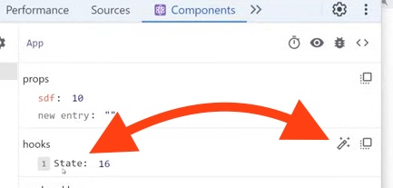
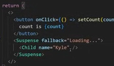
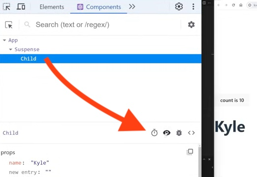
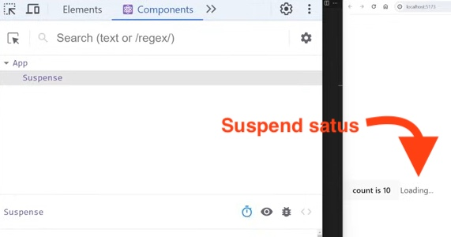
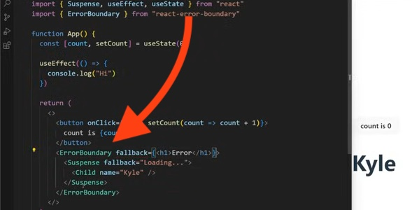
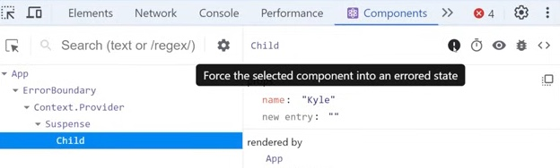

- [Debounced pattern](#debounced-pattern)
- [`useEffect`](#useeffect)
- [React Modal navigation](#react-modal-navigation)
- [Challenges on `useEffect`](#challenges-on-useeffect)
- [Use `data-` attr in React](#use-data--attr-in-react)
- [How To Debug React Apps Like A Senior Developer](#how-to-debug-react-apps-like-a-senior-developer)
  - [Show Hooks name](#show-hooks-name)
  - [Debug `Suspend`](#debug-suspend)
  - [Debug `ErrorBoundary`](#debug-errorboundary)
- [Perf in React](#perf-in-react)
- [What’s New in React 18](#whats-new-in-react-18)
- [React `forwardRef()`: How to Pass Refs to Child Components](#react-forwardref-how-to-pass-refs-to-child-components)
- [React Memory Leaks: How useCallback and closures can bite you](#react-memory-leaks-how-usecallback-and-closures-can-bite-you)
  - [Closures and `useCallback`](#closures-and-usecallback)
- [Snappy UI Optimization with useDeferredValue](#snappy-ui-optimization-with-usedeferredvalue)
- [memoization required](#memoization-required)
  - [Working with multiple state variables](#working-with-multiple-state-variables)

# Debounced pattern

Rule #1 the debounced callback must be memorized

https://tanstack.com/pacer/latest/docs/framework/react/examples/debounce

```js
const debouncedSetCount = useCallback(
  debounce(setDebouncedCount, {
    wait: 500,
  }),
  [], // 🚨🚨🚨 must be memoized to avoid re-creating the debouncer on every render (consider using useDebouncer instead in react)
)

```

Rule #2 use the debounced callback inside a state updater function

```js
function increment() {
  // this pattern helps avoid common bugs with stale closures and state
  setInstantCount((c) => {
    const newInstantCount = c + 1;
    debouncedSetCount(newInstantCount) // debounced state update
    return newInstantCount // instant state update
  })
}
```

Rule #3 manage the instant value and debounced value separately

```js
// For UI
const [instantCount, setInstantCount] = useState(0)

// For API call
const [debouncedCount, setDebouncedCount] = useState(0)
```

# `useEffect`

https://react.gg/visualized#managing-effects

`useEffect` takes place after render, but `useLayoutEffect` takes place before render.

# React Modal navigation

https://www.youtube.com/watch?v=42RKqciqjV0

https://reactnavigation.org/docs/stack-navigator/#presentation

# Challenges on `useEffect`

https://react.dev/learn/synchronizing-with-effects#challenges

1. for timer, it's necessary to clear it in cleanup function
2. for fetching data, it's the best practice to set a explicit flag, like `ignore`, to fix this type of problem.
3. [When something can be calculated from the existing props or state, don’t put it in state. Instead, calculate it during rendering.](https://react.dev/learn/you-might-not-need-an-effect#updating-state-based-on-props-or-state)
4. [the component state can be reset by offering a `key` props](https://react.dev/learn/you-might-not-need-an-effect#resetting-all-state-when-a-prop-changes)
5. [Update parent and children state in a single pass, but not `useEffect`](https://react.dev/learn/you-might-not-need-an-effect#notifying-parent-components-about-state-changes). React [batches updates](https://react.dev/learn/queueing-a-series-of-state-updates) from different components together, so there will only be one render pass.

# Use `data-` attr in React

```jsx
<Option data-name="data set name" />
```

> See more https://developer.mozilla.org/en-US/docs/Learn/HTML/Howto/Use_data_attributes

Adding a CSS Reset in CRA

https://create-react-app.dev/docs/adding-css-reset/

```css
@import-normalize; /* bring in normalize.css styles */

/* rest of app styles */
````

# How To Debug React Apps Like A Senior Developer

## Show Hooks name



## Debug `Suspend`

https://youtu.be/l8knG0BPr-o?t=645







## Debug `ErrorBoundary`

https://youtu.be/l8knG0BPr-o?t=786





# Perf in React

https://dev.to/headwayio/react-optimize-components-with-react-memo-usememo-and-usecallback-39h8

**Class Components**

- PureComponent
- shouldComponentUpdate

**Functional Components**

- React.memo
- useMemo
- useCallback.

**Heads up**

```js
const Header = React.memo(({ title }) => <h1>{title}</h1>, []);
export default Header;
```

The previous fashion will cause component to show up as `Unknow` in react dev tools. To fix this, wrap comp in `memo` after defining it, as following:

```js
const Header = ({ title }) => <h1>{title}</h1>;
export default React.memo(Header);
```

# What’s New in React 18

New Feature: Automatic Batching

| Before 18            | After 18              |
| -------------------- | --------------------- |
| React event handlers | promises              |
|                      | setTimeout            |
|                      | native event handlers |
|                      | or any other event    |

# React `forwardRef()`: How to Pass Refs to Child Components

https://dmitripavlutin.com/react-forwardref/

https://react.dev/reference/react/useImperativeHandle

https://dmitripavlutin.com/react-forwardref/#53-anonymous-component

In React dev tools an anonymous function wrapped in forwardRef() results in a component with an unmeaningful name.

https://dmitripavlutin.com/react-forwardref/#6-forwardref-in-typescript

`forwardRef<V, P>()` accepts 2 argument types:

- `V` is the type of the value stored in a ref, which is usually an `HTMLDivElement` or `HTMLInputElement`
- `P` is the props type of the wrapped component

`useRef<V>()` hook in TypeScript has one argument type `V`: denoting the value type stored in the ref. If you store DOM elements in the ref, `V` can be HTMLDivElement or HTMLInputElement.

Now let's annotate the parent and child components:

```ts
import { useRef, forwardRef } from "react";

export function Parent() {
  const elementRef = useRef<HTMLDivElement>(null);

  return <Child ref={elementRef} />;
}

const Child = forwardRef<HTMLDivElement>(function (props, ref) {
  return <div ref={ref}>Hello, World!</div>;
});
```

# React Memory Leaks: How useCallback and closures can bite you

https://schiener.io/2024-03-03/react-closures

## Closures and `useCallback`

```js
import { useState, useCallback } from "react";

class BigObject {
  public readonly data = new Uint8Array(1024 * 1024 * 10); // 10MB of data
}

function App() {
  const [count, setCount] = useState(0);
  const bigData = new BigObject();

  const handleEvent = useCallback(() => {
    setCount(count + 1);
  }, [count]);

  const handleClick = () => {
    console.log(bigData.data.length);
  };

  return (
    <div>
      <button onClick={handleClick} />
      <ExpensiveChildComponent2 onMyEvent={handleEvent} />
    </div>
  );
}
```

All closures share a common context object from the time they were created. Since handleClick() closes over bigData, bigData will be referenced by this context object. This means, bigData will never get garbage collected as long as handleEvent() is being referenced. This reference will hold until count changes and handleEvent() is recreated.


# Snappy UI Optimization with useDeferredValue

- https://www.joshwcomeau.com/react/use-deferred-value/
- https://react.dev/reference/react/useDeferredValue
- https://react.dev/blog/2024/04/25/react-19#use-deferred-value-initial-value

# memoization required

An important thing to note: useDeferredValue only works when the slow / low-priority component has been wrapped with React.memo():

```js
import React from "react";
function SlowComponent({ count }) {}

export default React.memo(SlowComponent);
```

## Working with multiple state variables

Don't:

```js
const deferredOomph = React.useDeferredValue(oomph);
const deferredCrispy = React.useDeferredValue(crispy);
const deferredBg = React.useDeferredValue(backgroundColor);
const deferredTint = React.useDeferredValue(tint);
const deferredResolution = React.useDeferredValue(resolution);
const deferredLight = React.useDeferredValue(lightPosition);
```

Do:

```js
const cssCode = generateShadows(
  oomph,
  crispy,
  backgroundColor,
  tint,
  resolution,
  lightPosition
);
const deferredCssCode = React.useDeferredValue(cssCode);
return (
  <>
    {/* Other stuff omitted for brevity */}
    <CodeSnippet lang="css" code={deferredCssCode} />
  </>
);
```
