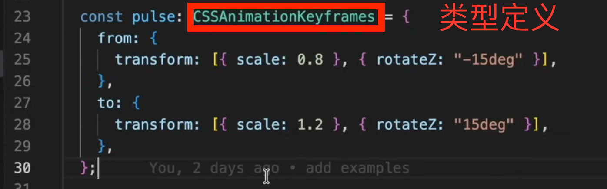
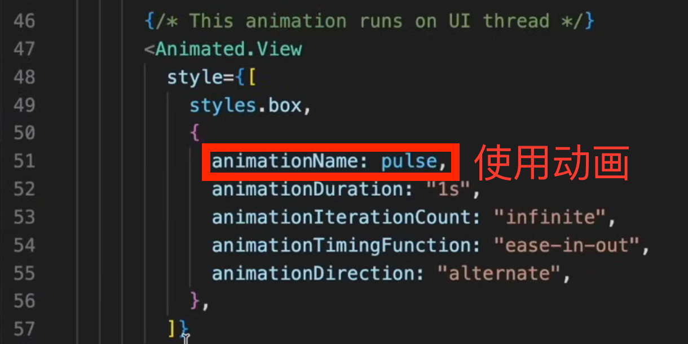

`interpolate`'s range must be always ascend in value.

https://animationbook.codedaily.io/interpolate#interpolate

```ts
[.2, 1] // ✅
[1, .2] // ❎ 
```

`useNativeDriver: true` require `<Animated.X>` series components. https://reactnative.dev/blog/2017/02/14/using-native-driver-for-animated#how-do-i-use-this-in-my-app

Caveats of `useNativeDriver: true`:
  1. support non-layout properties, such as `transform` and `opacity`, but not  Flex box and position properties.
  2. work with direct events, but not bubbling event(e.g. `PanResponder`).

[PanResponder](https://reactnative.dev/docs/panresponder)'s onPanResponderMove listener receives a `gestureState` object as second params, in which `dx` and `dy` can be used in `Animated.event` https://reactnative.dev/docs/animated#event.

```ts
onPanResponderMove: (event, gestureState) => {}

onPanResponderMove: Animated.event(
  [
     null,               // raw event arg ignored
     {dx: this._panX}    // gestureState arg
  ],
  { 
    listener: (event, gestureState) => console.log(event, gestureState)
  }, // Optional async listener
)
```

# use CSS animation in ReactNative



