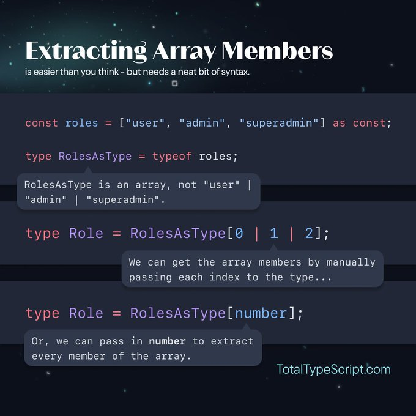
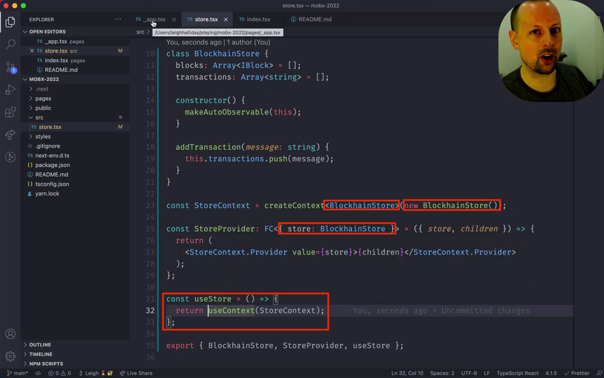

- [Define Promise returned type](#define-promise-returned-type)
- [confusion about import type](#confusion-about-import-type)
- [ban-types](#ban-types)
- [hack `map` / `filter` with `flatMap`](#hack-map--filter-with-flatmap)
- [Object argument in function](#object-argument-in-function)
- [Filtering undefined elements from an array in TypeScript](#filtering-undefined-elements-from-an-array-in-typescript)
- [Inline Error Raising with the Nullish Coalescing Operator](#inline-error-raising-with-the-nullish-coalescing-operator)
- [Extracting Array Member](#extracting-array-member)
- [Narrowing](#narrowing)
  - [`typeof` type guards](#typeof-type-guards)
  - [Truthiness narrowing](#truthiness-narrowing)
- [`!!` and `Boolean`](#-and-boolean)
  - [Equality narrowing](#equality-narrowing)
  - [The in operator narrowing](#the-in-operator-narrowing)
  - [`instanceof` narrowing](#instanceof-narrowing)
  - [Assignments](#assignments)
  - [Using type predicates](#using-type-predicates)
- [Reminds on Union and Intersection Types in TypeScript](#reminds-on-union-and-intersection-types-in-typescript)
  - [What's Union Types](#whats-union-types)
  - [As same key with different types happens](#as-same-key-with-different-types-happens)
    - [For Intersection Types](#for-intersection-types)
    - [For Union Types](#for-union-types)
- [Type inference in conditional types](#type-inference-in-conditional-types)
- [Unions and Intersection Types](#unions-and-intersection-types)
  - [Discriminating Unions（可辨识联合类型）](#discriminating-unions可辨识联合类型)
  - [Intersection Types](#intersection-types)
- [`satisfied` operator](#satisfied-operator)
- [Config TypeScript for NodeJS in 2023](#config-typescript-for-nodejs-in-2023)
- [Use `Context` with type safe](#use-context-with-type-safe)
- [Narrow `string` down to literals types](#narrow-string-down-to-literals-types)
- [Zod](#zod)
- [Retrieve value from an Object type](#retrieve-value-from-an-object-type)
- [`extends` in 4 scenarios](#extends-in-4-scenarios)
- [Indexed access types](#indexed-access-types)
- [Deriving types from an array of object](#deriving-types-from-an-array-of-object)
- [Use TypeScript's `never` to enforce "one or the other" properties on a type](#use-typescripts-never-to-enforce-one-or-the-other-properties-on-a-type)
- [Object literal may only specify known properties](#object-literal-may-only-specify-known-properties)
- [Being more specific with the type of the values](#being-more-specific-with-the-type-of-the-values)

# Define Promise returned type

https://www.apollographql.com/tutorials/intro-typescript/10-query-arguments

```js
getPlaylist(playlistId: string): Promise<Playlist> /* 👈 */ {
  return this.get(`playlists/${playlistId}`);
}
```

# confusion about import type

https://x.com/mattpocockuk/status/1795040643963555859


# ban-types

https://typescript-eslint.io/rules/ban-types/

Found this topic in the case:

```ts
// Don't use `{}` as a type. `{}` actually means "any non-nullish value".
<T>(viewProps: T extends {} ? A : B): C
```

- If you want a type meaning "any object", you probably want `object` instead.
- If you want a type meaning "any value", you probably want `unknown` instead.
- If you want a type meaning "empty object", you probably want `Record<string, never>` instead.
- If you really want a type meaning "any non-nullish value", you probably want `NonNullable<unknown>` instead.

> eslint@typescript-eslint/ban-types

# hack `map` / `filter` with `flatMap`

https://x.com/wesbos/status/1742254224787013718?s=20


# Object argument in function

```js
const o = {name: "foo"} 

function rename(obj) {
  // 🪄
  obj.name = "bar"
}

rename(o)

console.log(o) // bar
```


# Filtering undefined elements from an array in TypeScript

https://www.benmvp.com/blog/filtering-undefined-elements-from-array-typescript/

https://www.typescriptlang.org/docs/handbook/2/narrowing.html#using-type-predicates

```js
// Dirty
const productIds = [123, 456, 789]
const products = productIds
  .map(getProduct)
  .filter((item) => item) as Product[]

// Great
const isProduct = (item: Product | undefined): item is Product => {  return !!item}
const productIds = [123, 456, 789]
const products = productIds.map(getProduct).filter(isProduct)

// OR

const productIds = [123, 456, 789]
const products = productIds
  .map(getProduct)
  .filter((item): item is Product => !!item)
```

# Inline Error Raising with the Nullish Coalescing Operator

https://double-trouble.dev/post/typescript-tips/

```js
const raise = (err: string): never => {
  throw new Error(err);
};

const Page = (props: { params: { id?: string } }) => {
  const id = props.params.id ?? raise("No id provided");
};
```

# Extracting Array Member



# Narrowing

https://www.typescriptlang.org/docs/handbook/2/narrowing.html

## `typeof` type guards

- "string"
- "number"
- "bigint"
- "boolean"
- "symbol"
- "undefined"
- "object"
- "function"

## Truthiness narrowing

- 0
- NaN
- "" (the empty string)
- 0n (the bigint version of zero)
- null
- undefined

# `!!` and `Boolean`

The shorter double-Boolean negation has the advantage that TypeScript infers a narrow literal boolean type `true`, while inferring the `Boolean()` as type boolean.

```js
// both of these result in 'true'
Boolean("hello"); // type: boolean, value: true
!!"world"; // type: true,    value: true
```

## Equality narrowing

## The in operator narrowing

JavaScript has an operator for determining if an object has a property with a name: the in operator. TypeScript takes this into account as a way to narrow down potential types.

```js
type Fish = { swim: () => void };
type Bird = { fly: () => void };

function move(animal: Fish | Bird) {
  if ("swim" in animal) {
    return animal.swim();
  }

  return animal.fly();
}
```

## `instanceof` narrowing

## Assignments

## Using type predicates

# Reminds on Union and Intersection Types in TypeScript

## What's Union Types

Described in the document:

https://www.typescriptlang.org/docs/handbook/2/everyday-types.html#defining-a-union-type

> A union type is a type formed from two or more other types, representing values that may be any one of those types.

and:

https://www.tslang.cn/docs/handbook/advanced-types.html

> 联合类型表示一个值可以是几种类型之一。
>
> ...
>
> 如果一个值是联合类型，我们只能访问此联合类型的所有类型里**共有**的成员。

```js
interface Bird {
  fly();
  layEggs();
}

interface Fish {
  swim();
  layEggs();
}

function getSmallPet(): Fish | Bird {
  // ...
}

let pet = getSmallPet();
pet.layEggs(); // okay
pet.swim(); // errors
```

> 如果一个值的类型是 A | B，我们能够 确定的是它包含了 A 和 B 中共有的成员。 这个例子里， Bird 具有一个 fly 成员。 我们不能确定一个 Bird | Fish 类型的变量是否有 fly 方法。 如果变量在运行时是 Fish 类型，那么调用 pet.fly()就出错了。

It's explained with one more example in document:

> It might be confusing that a union of types appears to have the intersection of those types’ properties. This is not an accident - the name union comes from type theory. The union number | string is composed by taking the union of the values from each type. Notice that given two sets with corresponding facts about each set, only the intersection of those facts applies to the union of the sets themselves. For example, if we had a room of tall people wearing hats, and another room of Spanish speakers wearing hats, after combining those rooms, the only thing we know about every person is that they must be wearing a hat.

## As same key with different types happens

### For Intersection Types

```js
// X receives THREE properties: `name`, `age`, and `gender`.
// Age props with different types
type X = {
  name: string;
  age: number;
} & {
  gender: "M" | "F";
  age: string;
};

declare const x: X;

// Age will receives `never` types, with error:
// Type 'string' is not assignable to type 'never'.(2322)
x.age = "";
```

### For Union Types

```js
// X receives ONE property: `age`.
// Age props with different types
type X =
  | {
      name: string;
      age: number;
    }
  | {
      gender: "M" | "F";
      age: string;
    };

declare const x: X;

// Age will receives `string | number` types, without error.
x.age = "";
```

# Type inference in conditional types

https://www.typescriptlang.org/docs/handbook/release-notes/typescript-2-8.html#type-inference-in-conditional-types

# Unions and Intersection Types

https://www.typescriptlang.org/docs/handbook/unions-and-intersections.html

https://www.tslang.cn/docs/handbook/advanced-types.html

## Discriminating Unions（可辨识联合类型）

https://www.typescriptlang.org/docs/handbook/typescript-in-5-minutes-func.html#discriminated-unions

A common technique for working with unions is to have a single field which uses literal types which you can use to let TypeScript narrow down the possible current type.

你可以合并单例类型，联合类型，类型保护和类型别名来创建一个叫做 可辨识联合的高级模式，它也称做 标签联合或 代数数据类型。 可辨识联合在函数式编程很有用处。 一些语言会自动地为你辨识联合；而 TypeScript 则基于已有的 JavaScript 模式。 它具有 3 个要素：

- 具有普通的单例类型属性— 可辨识的特征。
- 一个类型别名包含了那些类型的联合— 联合。
- 此属性上的类型保护。

## Intersection Types

Intersection types are closely related to union types, but they are used very differently. An intersection type combines multiple types into one. This allows you to add together existing types to get a single type that has all the features you need. For example, Person & Serializable & Loggable is a type which is all of Person and Serializable and Loggable. That means an object of this type will have all members of all three types.

# `satisfied` operator

https://devblogs.microsoft.com/typescript/announcing-typescript-4-9/#the-satisfies-operator

https://www.youtube.com/watch?v=ShPBpi7Vxr0

```js
type Name = Record<string, number | string>;

const n1: Name = {
  age: 19,
};

// const age1: string | number 🤔
const age1 = n1.age;

const n2 = {
  age: 19,
} satisfies Name;

// const age: number 💯
const age2 = n2.age;
```

# Config TypeScript for NodeJS in 2023

https://www.youtube.com/watch?v=H91aqUHn8sE&t=2s

Install dependencies

```shell
yarn add -D typescript @types@node
```

Update `package.json`

```json
{
  "type": "module", 🚀
  "scripts": [
    "build": "tsc"
  ]
}
```

In `tsconfig.json`

```json
{
  "compilerOptions": {
    "target": "ES2020" /* Set the JavaScript language version for emitted JavaScript and include compatible library declarations. */,
    "module": "NodeNext" /* Specify what module code is generated. */,
    "moduleResolution": "NodeNext" /* Specify how TypeScript looks up a file from a given module specifier. */,
    "outDir": "./dist" /* Specify an output folder for all emitted files. */
  },
  "include": ["./src/**/*"]
}
```

With the `"moduleResolution": "NodeNext"` option, the `import` statement is required to specify extension explicitly.

```js
// Relative import paths need explicit file extensions in EcmaScript imports when '--moduleResolution' is 'node16' or 'nodenext'. Did you mean './helper.js'?ts(2835)
import { helper } from "./helper";

// `.js`, not `.ts`! Even though the source is `helper.ts`
import { helper } from "./helper.js";
```

# Use `Context` with type safe

```js
interface User {
  name: string;
  age: number;
}

const userContext = createContext<User | null 🌟>(null)

const useUser = () => {
  const context = useContext(userContext);

  if (!context 🌟) {
    throw new Error('Context should be used within a provider.');
  }

  return context;
}
```

One more way to type guard `Context`:



# Narrow `string` down to literals types

```js
type Fruits = "banana" | "apple" | "orange";
let apple = "apple";

// error: typeof "fruits" = string;
// type "string" is not assignable to type Fruits
let fruits: Fruits = apple;

// Fix
// 1 or
let apple = "apple" as const;

// 2 or
const apple = "apple";
let fruits: Fruits = apple;

// 3
// works outside of .tsx files
fruits = <const>apple;
fruits: Fruits = <const>"banana";
```

> **Bonum Tip** `<const> true` and `<const> false` to represent a boolean that must be `true` or `false`.

> Seen also: https://www.typescriptlang.org/docs/handbook/2/everyday-types.html#literal-inference

> https://www.typescriptlang.org/docs/handbook/release-notes/typescript-3-4.html#const-assertions

# Zod

TypeScript-first schema validation with static type inference

https://www.npmjs.com/package/zod

# Retrieve value from an Object type

https://www.typescriptlang.org/docs/handbook/release-notes/typescript-4-1.html#key-remapping-in-mapped-types

```js
type Fruit =
  | { name: "apple"; color: "red" }
  | { name: "banana"; color: "yellow" }
  | { name: "orange"; color: "orange" };

type FruitName = Fruit["name"];
type TransformedFruit = {
  [F in Fruit as F["name"]]: `${F["name"]}:${F["color"]}`;
}[FruitName];

type Expected = "apple:red" | "banana:yellow" | "orange:orange";

// Break down step by step
// `F in Fruit`` equals
type Apple = { name: "apple"; color: "red" };
type Banana = { name: "banana"; color: "yellow" };
type Orange = { name: "orange"; color: "orange" };

// `as F["name"]` equals
// `as` clause to remap property name.
type AppleName = Apple["name"];
type BananaName = Banana["name"];
type OrangeName = Orange["name"];

// Those two are same
type Name1 = AppleName | BananaName | OrangeName;
type Name2 = Fruit["name"];

/**
 * type FruitMapped = {
    apple: "apple:red";
    banana: "banana:yellow";
    orange: "orange:orange";
 * }
 */
type FruitMapped = {
  [F in Fruit as F["name"] /* Filter keys */]: `${F["name"]}:${F["color"]}`;
};

// OR type Result = FruitMapped[Name2]
type Result = FruitMapped[Name1];
```

# `extends` in 4 scenarios

```js
// Class
class Dog extends Animal {}

// Interface
interface Dog extends Animal {}

// Generic
type Dog<T extends { domesticated: boolean }> = T & Animal;

// Conditional Types
type Dog<T> = T extends { legs: number } ? Animal : never;
```

# Indexed access types

```js
interface ColorType {
  primary: "red";
  secondary: "blue";
  tertiary: "green";
}

// type ColorValue = "red" | "blue" | "green"
type ColorValue = ColorType[keyof ColorType];

const color = ["red", "blue", "green"] as const;
// type Color = "red" | "blue" | "green"
// https://www.typescriptlang.org/docs/handbook/2/indexed-access-types.html
type Color = (typeof color)[number];

interface UserRoleConfig {
  user: ["read", "update"];
  superuser: ["read", "create", "update", "remove"];
}

// type Actions = "read" | "update" | "create" | "remove"
type Actions = UserRoleConfig[keyof UserRoleConfig][number];
```

# Deriving types from an array of object

```js
const duration = [
  {
    label: "Foo",
    value: 1,
  },
  {
    label: "Bar",
    value: 3,
  },
] as const;

// 1 | 3
type DurationValue = (typeof duration)[number]["value"];
```

# Use TypeScript's `never` to enforce "one or the other" properties on a type

```js
type Base = {
  name: string;
};

interface Free extends Base {
  url: string;
  price?: never;
}

interface Paid extends Base {
  url?: never;
  price: number;
}

type Course = Free | Paid;

// Type 'string' is not assignable to type 'undefined'.
const course: Course = {
  name: "Hello World",
  price: 5,
  url: "",
};
```

# Object literal may only specify known properties

https://stackoverflow.com/questions/61698807/interesting-behaviour-object-literal-may-only-specify-known-properties

```js
type Person = { name: string };

// Error: Object literal may only specify known properties, and 'age' does not exist in type 'Person'.
const person: Person = { name: "Sarah", age: 13 };
```

So this fails, because property age is not a part of type Person which makes sense.

However, I can do this without any problems:

```js
type Person = { name: string };

const obj = { name: "Sarah", age: 13 };
const person: Person = obj;

console.log(person); // { name: 'Sarah', age: 13 }
```

Why the first one is failing and the second is not - shouldn't these 2 examples both fail or both pass?

As for me these 2 code snippets are identical. Aren't they?

Here's an explanation of this behavior from [Typescript Handbook](https://www.typescriptlang.org/docs/handbook/interfaces.html#excess-property-checks):

Object literals get special treatment and undergo excess property checking when assigning them to other variables, or passing them as arguments. If an object literal has any properties that the “target type” doesn’t have, you’ll get an error.

> TL;DR: when initializing with a literal the TSC is strict

# Being more specific with the type of the values

https://bobbyhadz.com/blog/typescript-object-literal-may-only-specify-known-properties#being-more-specific-with-the-type-of-the-values

```js
type Employee = {
  id: number;
  [key: string]: string | number;
};

const emp: Employee = {
  id: 1,
  name: "Bobby Had",
  department: "accounting",
  salary: 100,
};
```

When using this approach, you aren't able to add string keys that have a value of type other than `string | number`.

```js
type Employee = {
  id: number;
  [key: string]: string | number;
  // ⛔️ Error: Property 'years' of type 'number[]'
  // is not assignable to 'string' index type 'string | number'.
  years: number[];
};
```

With our index signature of `[key: string]: string | number`, we told TypeScript that when a `string` key is accessed, it will return a value that is a `string` or a `number`, so we can't add another `string` key that has a type of `number[]`.

To get around this, you have to add `number[]` to the union type.

```js
type Employee = {
  id: number;
  [key: string]: string | number | number[]; // 🚀
  years: number[];
};

const emp: Employee = {
  id: 1,
  name: "Bobby Had",
  department: "accounting",
  salary: 100,
  years: [2022, 2023],
};
```
